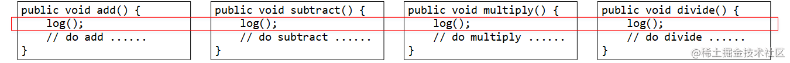

## aop_easy



只要方法的**开始 / 结束**都有相同的逻辑，那我们就可以把这些逻辑都拿出来视为一体，这个思想就叫**横切**。
图中红框我们称它为**横切面Aspect**，**表示的是分布在一个 / 多个类的多个方法中的相同逻辑。**

使用**动态代理**，将这部分**相同的逻辑**抽取为**一个独立的`Advisor`增强器**，并在原始对象的初始化过程中，**动态`组合`原始对象并产生代理对象**。

通过这种方式，**在不修改原始代码的情况下，对已有的任意代码进行了增强**，这个**针对代码的扩展和抽取的过程，就是面向切面编程。**

### 1. jdk动态代理

**jdk 动态代理**，要求被代理的对象所属类**必须实现一个以上的接口**，代理对象的创建使用 `Proxy.newProxyInstance` 方法，该方法中有三个参数

- `ClassLoader loader`：被代理的对象所属类的类加载器
- `Class<?>[] interfaces`：被代理的对象所属类实现的接口
- `InvocationHandler h`：代理的具体代码实现

具体实现在 `InvocationHandler`的`invoke方法`中，这个方法有三个参数

- `Object proxy`：**被代理后的**对象引用
- `Method method`：代理对象**执行的方法**
- `Object[] args`：代理对象**执行方法的参数列表**

### 2. Cglib

使用Cglib的**前提**: **被代理的类不能是 final 的**（ Cglib 动态代理会创建子类，final 类型的 Class 无法继承），
**被代理的类必须有默认的 / 无参构造方法**（底层反射创建对象时拿不到构造方法参数）

**Cglib 动态代理**创建代理对象使用`Enhancer.create`方法，这个方法需要两个参数

- `Class type`：被代理的对象所属类的类型
- `Callback callback`：增强的代码实现，创建的是`MethodInterceptor`对象，增强类的方法

`MethodInterceptor`的 **`intercept`方法**相比于`invoke方法`多了一个`MethodProxy`参数，它是对Method的封装，
用它能直接执行被代理对象的方法

```
// 执行 代理对象 的方法
method.invoke(proxy, args);

// 执行 原始对象(被代理对象) 的方法
methodProxy.invokeSuper(proxy, args);
```

### 3. 理解AOP

**AOP面向切面编程，它是对面向对象对象编程（OOP）的补充。OOP关注的是对象，AOP的关注是切面。
AOP可以在不修改代码的前提下，通过动态代理对已有的代码进行增强。**

AOP 要完成的核心工作还是一个：**解耦**。AOP 将分散在各个类中方法的重复逻辑抽取为一个**切面**，并在**运行时生成代理对象**，
将这些重复逻辑组合进原有的对象，这其实就是完成了**原有业务与扩展逻辑之间的解耦**。
最大的好处是：**业务逻辑只需要关注业务逻辑，每个扩展逻辑也都只关心自己的实现和切入业务逻辑的位置即可**。

#### 3.1 术语

- **Target**: **被代理的对象**
- **Proxy**: **代理对象，相当于是代码中 `Proxy.newProxyInstance` 返回的结果**
- **JoinPoint**: **连接点，可以简单的理解为目标对象的所属类中，定义的所有方法**
- **Pointcut**: **切入点，那些被拦截 / 被增强的连接点。代理会选择目标对象的一部分连接点作为切入点，
  在目标对象的方法执行前 / 后作出额外的动作，切入点一定是连接点，连接点不一定是切入点**
  
- **Advice**: **增强的逻辑，Proxy 代理对象 = Target 目标对象 + Advice 通知**
- **Aspect**: **切面，Aspect 切面 = PointCut 切入点 + Advice 通知，`InvocationHandler`，`MethodInterceptor` ，这些都可以看作是切面**
- **Weaving**: **织入，织入就是将 Advice 通知应用到 Target 目标对象，进而生成 Proxy 代理对象的过程**
- **Introduction**: **引入，针对 Class 类，它可以在不修改原有类的代码的前提下，在运行期为原始类动态添加新的属性 / 方法**，了解即可

#### 3.2 通知的类型

- **Before 前置通知**: 目标对象的方法调用之前触发
- **After 后置通知**: 目标对象的方法调用之后触发
- **AfterReturning 返回通知**: 目标对象的方法调用完成，在返回结果值之后触发
- **AfterThrowing 异常通知**: 目标对象的方法运行中抛出 / 触发异常后触发 
   - **AfterReturning 与 AfterThrowing 两者是互斥的**！如果方法调用成功无异常，则会有返回值；如果方法抛出了异常，则不会有返回值
    
- **Around 环绕通知**: **编程式控制目标对象的方法调用**。环绕通知是所有通知类型中可操作范围最大的一种，因为它可以直接拿到目标对象，
  以及要执行的方法，所以环绕通知可以任意的在目标对象的方法调用前后搞事，甚至不调用目标对象的方法
  (我们写的`InvocationHandler`和`MethodInterceptor`都是环绕通知)
  
### 4. xml配置AOP

- **execution**
   - 可以使用*作为通配符
   - 在参数列表中标注一个*，代表方法的参数列表必须有一个参数
   - `..`来指定方法有任意个参数，也可以没有参数

### 5. 注解配置AOP

- 使AOP注解生效，要标记上`EnableAspectJAutoProxy`注解
- 上述execution相关的都是可以在 **@Before、@After、@AfterReturning、@AfterThrowing、@Around** 中使用的
- 注解 `@PointCut` 标记在一个**空方法**上，注解中可以**配置execution**或**注解**切入，**供五种通知类型注解使用**

### 6. AOP的应用场景

- **业务日志切面**：可以记录业务方法调用的痕迹
- **事务控制**：通过切面可以声明式控制事务
- **权限校验**：执行方法之前先校验当前登录用户是否有权调用
- **数据缓存**：执行方法之前先从缓存中取，取到则直接返回不走业务方法

### 7. ProceedingJoinPoint

`ProceedingJoinPoint` 注解环绕通知的入参，它是基于 `JoinPoint` 的扩展，扩展了`proceed方法`，**相当于invoke**。
能通过调用这个方法来执行被代理对象的原始方法，当然也可以修改方法的入参。

使用`@Order`或实现**Orderd接口**来控制切面的执行顺序

`AopContext`**能在当前代理对象中取到自身，而不用为了拦截自身的方法而再将自身注入进来**

### 8. AOP的失效场景

- **代理对象调用自身的方法时，AOP 通知会失效**
  - 即在代理对象中直接调用 `this.xxx` 方法
  - 正确做法是借助 `AopContext` 取到当前代理对象并强转，之后调用，这样 AOP 通知依然会执行

- 代理对象在**后置处理器还没有初始化的时候**，提前创建了，则 AOP 通知不会织入
