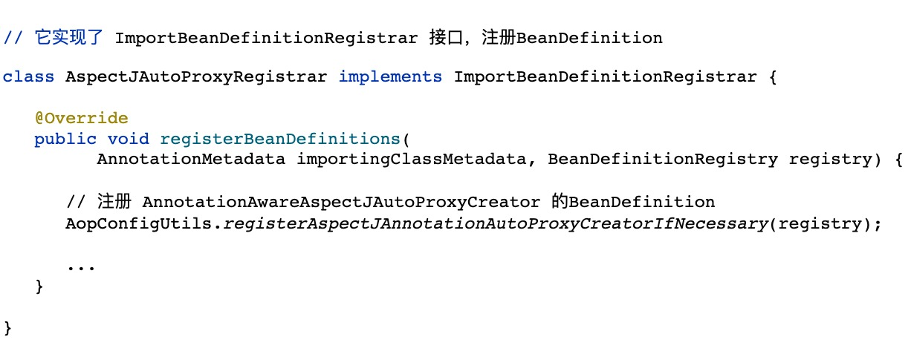

## aop_origin
### 1. AOP代理的底层核心后置处理器
AOP 的核心后置处理器是 `AnnotationAwareAspectJAutoProxyCreator`

#### 1.1 AspectJAutoProxyRegistrar注册后置处理器的时机

### 2. AnnotationAwareAspectJAutoProxyCreator

它实现了基础抽象类 `AbstractAutoProxyCreator`和一些接口，其中

- **BeanPostProcessor**：用于在 `postProcessAfterInitialization 方法`中生成代理对象
- **InstantiationAwareBeanPostProcessor**：拦截 bean 的正常 `doCreateBean` 创建流程，**跳过一些不需要被增强的bean**
- **AopInfrastructureBean**：实现了该接口的 bean **永远不会被代理**（防止套娃）

在抽象类 `AbstractAutoProxyCreator`中，可以查看对应的后置处理器执行的逻辑

它会在`refresh方法`的第6步，创建`BeanPostProcessor`时被创建，而且它实现了`Ordered接口`，并指定了**最高的创建优先级**，
这样它就能干预

创建代理对象的核心步骤
1. 判断bean是不是**不会被增强的bean**，像`@Aspect`标注的bean肯定不会被增强
2. **根据当前正在创建的bean去匹配增强器，有的话则创建代理对象**