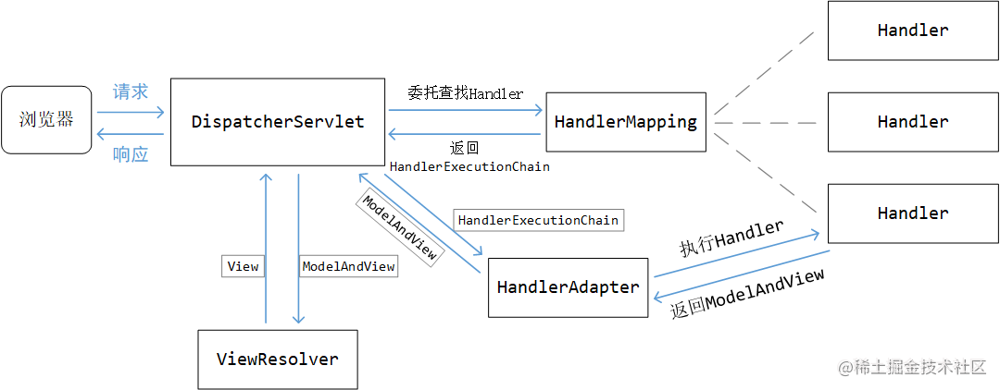
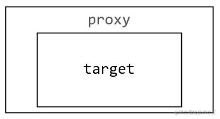
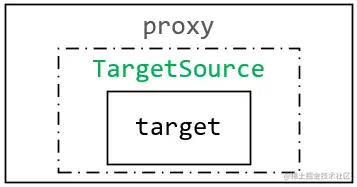

## aop_origin
### 1. AOP代理的底层核心后置处理器
AOP 的核心后置处理器是 `AnnotationAwareAspectJAutoProxyCreator`

#### 1.1 AspectJAutoProxyRegistrar注册后置处理器的时机

### 2. AnnotationAwareAspectJAutoProxyCreator

它实现了基础抽象类 `AbstractAutoProxyCreator`和一些接口，其中

- **BeanPostProcessor**：用于在 `postProcessAfterInitialization 方法`中生成代理对象
- **InstantiationAwareBeanPostProcessor**：拦截 bean 的正常 `doCreateBean` 创建流程，**跳过一些不需要被增强的bean**
- **AopInfrastructureBean**：实现了该接口的 bean **永远不会被代理**（防止套娃）

在抽象类 `AbstractAutoProxyCreator`中，可以查看对应的后置处理器执行的逻辑

它会在`refresh方法`的第6步，创建`BeanPostProcessor`时被创建，而且它实现了`Ordered接口`，并指定了**最高的创建优先级**，
这样它就能干预

创建代理对象的核心步骤
1. 判断bean是不是**不会被增强的bean**，像`@Aspect`标注的bean肯定不会被增强
2. **根据当前正在创建的bean去匹配增强器，有的话则创建代理对象**

### 3. AOP是如何收集切面类并封装的
根本上是 **将 Aspect切面类，转换为一个个Advisor增强器**

#### 3.1 aspectJAdvisorsBuilder.buildAspectJAdvisors

方法名顾名思义: **构建Aspect的增强器们**，整体逻辑并不难，需要注意的点

- 获取bean的类型是通过`BeanFactory`获取的，而没有调用`getBean方法`，创建完bean后再获取类型，这样避免了bean的提前创建

之后会处理标有`@Aspect`注解的类，将其中的通知方法封装成增强器

首先它会把类中**所有的**方法都抽取出来，如上图所示，即使是没有标注任何注解的方法

之后构建Advisors时，会调用`getAdvisor方法`，在这一步会将方法进一步筛选，**只剩下标有通知注解的方法**，如下

包含的信息：**切入点表达式**和**通知方法**

#### 3.2 TargetSource的设计

**AOP 的代理其实不是代理的目标对象本身，而是目标对象包装后的 TargetSource 对象**

之前写的动态代理的例子都是如下图所示，直接代理的target对象

但是实际上Spring为Target加了一层壳，这层壳就是`TargetSource`，如下图

执行被代理对象的方法时，就需要这样调用 `method.invoke(targetSource.getTarget(), args)`

这样每次调用被代理对象的方法时，都需要执行`targetSource.getTarget()`方法，
那么这就可以通过TargetResource来**控制每次方法调用时作用的具体对象实例，从而让方法的调用更加灵活**

它有几个实现如下
- **SingletonTargetSource**：每次 getTarget 都返回同一个目标对象 bean 
- **PrototypeTargetSource**：每次 getTarget 都会从 BeanFactory 中创建一个全新的 bean 
- **CommonsPool2TargetSource**：内部维护了一个对象池，每次 getTarget 时从对象池中取
- **ThreadLocalTargetSource**：每次 getTarget 都会从它所处的线程中取目标对象
- **HotSwappableTargetSource**：内部维护了一个可以热替换的目标对象引用，每次 getTarget 的时候都返回它

### 4. Bean是如何被AOP代理的
bean的初始化会被 `BeanPostProcessor` 的 `postProcessAfterInitialization方法` 处理，
代理对象的创建即在 `AbstractAutoProxyCreator` 的 `postProcessAfterInitialization方法`中，其中调用了 `wrapIfNecessary方法`

#### 4.1 wrapIfNecessary方法

在这个方法中，它会去**找到这个bean下所有的增强器（Advisor）**，另外它会**加一个默认的**`new DefaultPointcutAdvisor(INSTANCE)`增强器，
其中`INSTANCE`是单例的设计，它的类型是 `ExposeInvocationInterceptor`

这个`INSTANCE`有啥用呢？去它的类里看看，有如下方法

找到所有的增强器后，之后便是创建代理对象，**如果要代理的对象本身是接口或者已经被jdk动态代理了，那么就采用jdk动态代理，否则使用的是Cglib动态代理**