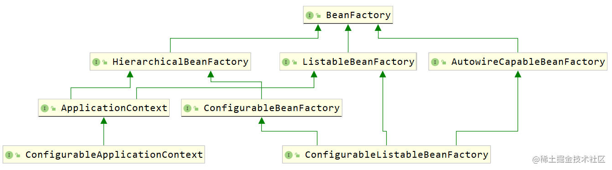
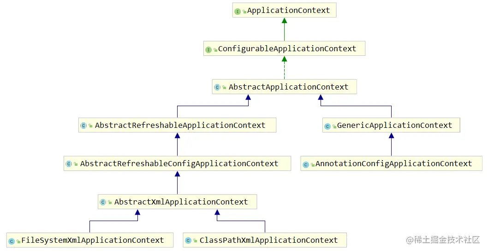
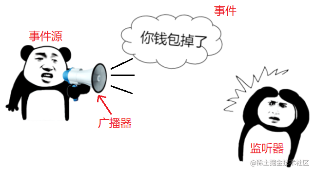
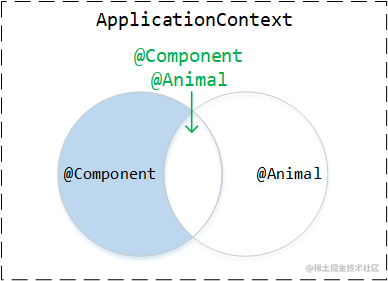

## ioc_medium


### 1. BeanFactory和它的子接口们

BeanFactory的基础特性：

- **最基础的容器**
- **定义了作用域的概念**
- **集成环境配置**(Environment)：它本身是所有 Bean 的注册中心，所有的 Bean 最终都在BeanFactory中创建和保存。
  另外 BeanFactory 中还集成了配置信息，咱通过加载外部的 properties 文件，借助 SpringFramework 的方式将配置文件的属性值设置到 Bean 对象中。
- **支持多种类型的配置源**(Resource, PropertySource)
- **完整的生命周期控制机制**
- **层次性的设计**：可以支持**父子结构**，由HierarchicalBeanFactory实现

#### 1.1 HierarchicalBeanFactory

实现BeanFactory的子接口，它可以理解为是层次结构的一部分。
可以在 `ConfigurableBeanFactory` 接口中找到用于 BeanFactory 的相应 `setParentBeanFactory` 方法，该方法允许以可配置的方式设置父对象

如果当前容器中找不到就往上找，那如果找到了就不往上找了。但是**如果当前 BeanFactory 中有指定的 Bean 了，父 BeanFactory 中可能有吗**？

**答案是有，因为即便存在父子关系，但他们本质上是不同的容器，所以有可能找到多个相同的 Bean 。**
换句话说，@Scope 中声明的 Singleton 只是在一个容器中是单实例的，但有了层次性结构后，对于整体的多个容器来看，就不是单实例的了。

#### 1.2 ListableBeanFactory

它的扩展功能是能让咱在拿到 BeanFactory 时可以直接把容器中的所有 Bean 都拿出来，但是它列举的仅仅是**当前容器中的Bean**

（可以看IOCMediumApplication中的代码例子）

#### 1.3 ConfigurableBeanFactory

`Configurable` **开头**的 BeanFactory 或者 ApplicationContext 就具有了 set（可写）的操作，
可以调用里边儿的定义的方法对BeanFactory进行修改和扩展等，但是它不推荐给开发者使用，因为在程序运行期间不应该对BeanFactory进行频繁的变动。

### 2. BeanFactory的实现类们

#### 2.1 AbstractBeanFactory

它是BeanFactory**最基础的抽象实现类，具有基础的功能**，此外它还扩展了一些功能：别名的处理（来源于 AliasRegistry 接口）、
Bean 定义的合并、Bean 的销毁动作支持等，而且它还定义了模板方法`getBeanDefinition` 和 `createBean`

#### 2.2 AbstractAutowireCapableBeanFactory

它提供Bean的创建逻辑实现，具有**Bean 的创建**、**属性填充和依赖的自动注入**、**Bean 的初始化**功能。

它有`resolveDependency(DependencyDescriptor, String, Set, TypeConverter)`模板方法，具有解析Bean的成员中定义的属性依赖关系，
但是**不负责**BeanDefinition的注册。

#### 2.3 DefaultListableBeanFactory

DefaultListableBeanFactory是BeanFactory的最终默认实现，它的作用是**先注册 Bean 的定义信息(BeanDefinitionRegistry)，
再完成 Bean 的创建和初始化动作(AbstractAutowireCapableBeanFactory)**

### 3. ApplicationContext和它的上下辈们


ApplicationContext是Spring中最核心的接口，在BeanFactory基础上扩展了**生命周期管理**，**Bean和BeanFactory的后置处理器**，**国际化**以及**事件发布机制**。

继承`ListableBeanFactory`可以访问应用程序中的组件Bean，继承`ResourceLoader`能加载文件资源，
继承`ApplicationEventPublisher`实现事件的发布和监听机制，继承`MessageSource`实现国际化，继承`HierarchicalBeanFactory`以支持父子上下文。

虽然`ApplicationContext`实现了`BeanFactory`接口，但是它与BeanFactory的关系是组合，包括对其他的接口实现一样，在底层也是组合了它们。

#### 3.1 ConfigurableApplicationContext

注意它也是`Configurable`开头的，那么它会提供 **"可写"** 的功能，为ApplicationContext添加了配置的功能，它有定义**指定父容器**，**Environment**，
**BeanFactory的后置处理器**的方法等

#### 3.2 EnvironmentCapable

在 SpringFramework 中，**以 Capable 结尾的接口**，**通常意味着可以通过这个接口的某个特定的方法（通常是 `getXXX()` ）拿到特定的组件。**
ApplicationContext实现了这个接口，那么它能拿到`Environment`对象。

我们可以这么理解，Spring的应用在运行时包含两部分：**应用程序本身**和**应用程序运行时的环境**。`Environment`就类似于**运行环境的抽象对象**，
它内部保存着一些程序运行的配置。

### 4. ApplicationContext的实现类们


#### 4.1 AbstractApplicationContext

它是Application中最核心的实现类，没有之一。它定义和实现了**绝大部分应用上下文的特性和功能**。

使用了模板方法模式，实际的动作由子类去实现。直接继承了`DefaultResourceLoader`，提供默认的加载资源文件策略，从classpath下加载。

#### 4.2 AbstractXmlApplicationContext

它是最终 `ClassPathXmlApplicationContext` 和 `FileSystemXmlApplicationContext` 的直接父类，已**具备全部基本功能**。
根据子类不同的配置文件，实现`getConfigResources` 和/或 `getConfigLocations` 方法即可。

#### 4.3 ClassPathXmlApplicationContext

它是一个最终落地实现，对classpath下的xml文件进行加载，如果有多个配置，它解析配置文件有先后之分，
较新的BeanDefinition会覆盖掉之前的BeanDefinition。

#### 4.4 AnnotationConfigApplicationContext

它继承了`GenericApplicationContext` ，那自然它也只能刷新一次(因为GenericApplicationContext只能刷新(`refresh()方法`)一次)，
注解驱动的IOC容器。

它也有配置覆盖的概念，如果有多个 `@Configuration` 类，则在以后的类中定义的 `@Bean` 方法将覆盖在先前的类中定义的方法。
这可以通过一个额外的 `@Configuration` 类来故意覆盖某些 `BeanDefinition`。

它可以配合`XmlBeanDefinitionReader`，这样就能够注解驱动和xml配置通吃了。

### 5. 事件机制
#### 5.1 观察者模式
观察者模式也被称为**发布订阅模式**，被观察的对象做出**某些动作**，**会自动通知到它的订阅者**。它的三大核心是：**观察者，被观察的主题，订阅者。**
观察者需要绑定要通知的订阅者，并且要观察指定的主题。

在Spring中体现观察者模式的就是**事件驱动和监听器**，**监听器（Listener）对应订阅者**，事件源充当被观察的主题，用来发布事件，
**IOC容器本身也是事件广播器，可以理解为观察者。** 可根据下图继续理解



#### 5.2 了解Spring内置事件

Spring容器内置事件

- **ContextRefreshedEvent**:  IOC容器刷新完毕但尚未启动，所有单实例 Bean 刚创建完
- **ContextClosedEvent**: IOC容器已经关闭但尚未销毁所有Bean
- **ContextStartedEvent**
- **ContextClosedEvent**

我们点击以上任意一个事件，都是根据`ApplicationContextEvent`进行扩展的，如下


#### 5.3 自定义事件
实现ApplicationEvent来自定义事件（直接实现它并没有太大意义，更像是具体业务的触发时机），创建对应事件的监听器，在其中完成想要的业务

### 6. 模块装配

模块装配就是**把一个功能模块需要的核心功能组件都装配好**，它的核心原则是：**自定义注解搭配@Import导入需要的组件。**
类似一些常见的`@Enablexxx`

四种模块装配的方式(以`@EnableTavern`注解为例)
- 导入普通类（`Boss`）
- 导入配置类（`BartenderConfiguration`）
- 导入ImportSelector（`BarImportSelector`）
- 导入ImportBeanDefinitionRegistrar（`WaiterRegister`）

### 7. 条件装配
#### 7.1 profile
可以通过使用`@Profile`注解来指定配置文件条件注入想要的bean.

#### 7.2 condition
使用`@Conditional`注解，并创建条件类实现Condition接口来定义条件注入的规则

### 8. 组件扫描
#### 8.1 ComponentScan的basePackageClasses参数
这个参数指定多个类，扫描的范围是该类所在的包及其子包下的所有Bean，
它的**默认扫描规则**是对以 `@Component` 、`@Repository` 、`@Service` 或 `@Controller` 注解的类的自动检测。

#### 8.2 exclude

```java
@Configuration
@ComponentScan(
        basePackageClasses = Red.class,
        excludeFilters = @ComponentScan.Filter(type = FilterType.ANNOTATION, value = Animal.class))
public class BasePackageClassConfiguration {
}
```

定义排除Animal注解的Bean，扫描范围如下



#### 8.3 include

```java
@Configuration
@ComponentScan(
        basePackageClasses = Red.class,
        excludeFilters = @ComponentScan.Filter(type = FilterType.ANNOTATION, value = Animal.class),
        includeFilters = @ComponentScan.Filter(type = FilterType.ANNOTATION, value = Color.class))
public class BasePackageClassConfiguration {
}
```

定义包含`Color`注解的Bean，即便没有在Black的类上添加Component注解，添加上了Color注解也是能扫描的

```java
@Color
public class Black {
}
```

#### 8.4 自定义过滤

自己定义一个过滤器实现`TypeFilter`接口就行，之后在包扫描中指定过滤类型为`FilterType.CUSTOM`