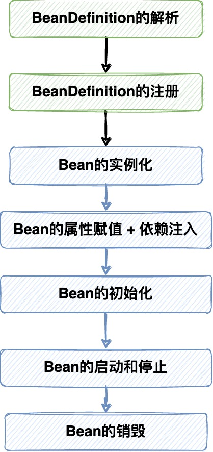
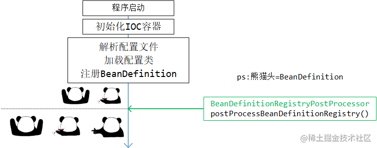
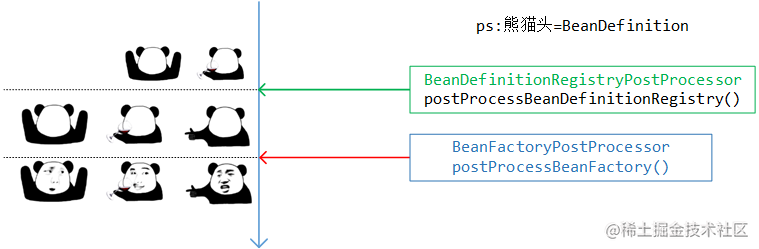
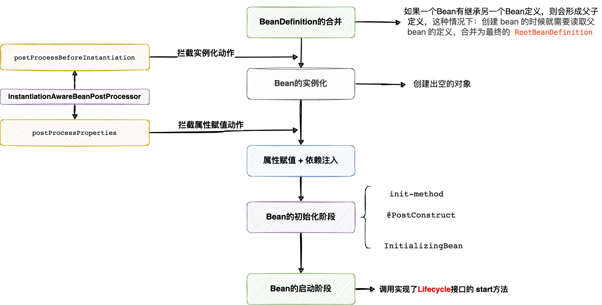
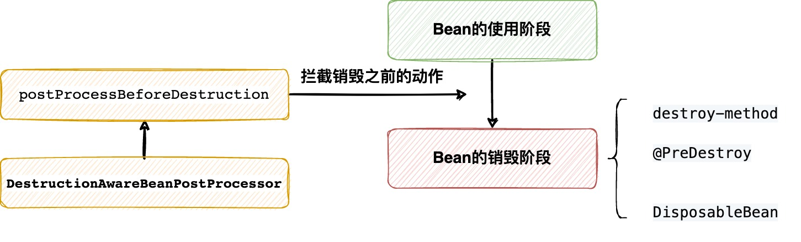
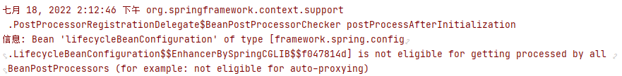
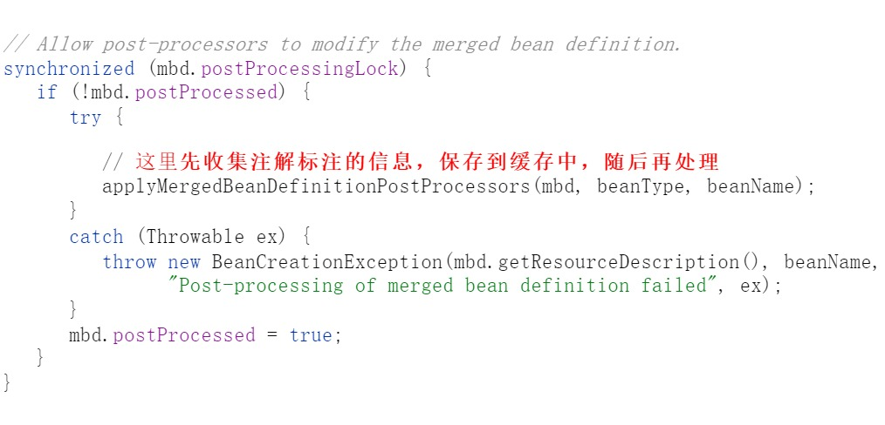
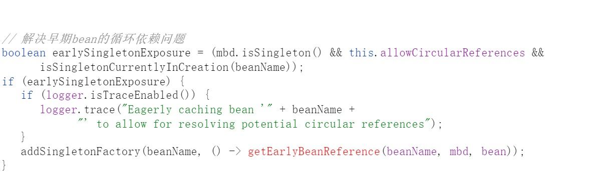

## ioc_origin
### 1. Bean的生命周期总览

#### 1.1 BeanDefinition

`BeanDefinition` 都构造好之后，是不会立即注册到 `BeanFactory` 的，
这中间有一步执行 `BeanDefinitionRegistryPostProcessor` 的**注册新的BeanDefinition的动作**，
等这些 `BeanDefinitionRegistryPostProcessor` 都执行完 `postProcessBeanDefinitionRegistry` 方法后，
`BeanDefinition` 才会注册到 `BeanFactory`

这个动作之后，下一步则是执行 `BeanFactoryPostProcessor` 的 `postProcessBeanFactory` 方法 **修改BeanDefinition配置信息**，
添加注入的依赖项，给属性赋值等操作。

这下之后，`BeanDefinition` 就不再改变了，宣告 `BeanDefinition` 的阶段结束

#### 1.2 Bean实例阶段内容

Bean初始化完成后即进入**运行期使用阶段**，使用完进入**销毁阶段**

### 2. BeanDefinition阶段细则！
#### 2.1 xml配置文件的BeanDefinition的加载

`ClassPathXmlApplicationContext`执行refresh方法，借助`XmlBeanDefinitionReader`**读取xml配置文件**，
之后借助`DefaultBeanDefinitionDocumentReader`**解析xml配置文件**，将`<bean>`标签封装成`BeanDefinition`，注册到`BeanDefinitionRegistry`中

在`BeanDefinitionRegistry`中是以Map的形式保存，**key: beanName, value: beanDefinition**,
beanName没有在BeanDefinition中保存，而是**封装在了BeanDefinitionHolder中**，**要不然beanName就拿不到了**

#### 2.2 注解配置类的BeanDefinition的加载

注解配置类的解析发生在 `ApplicationContext` 执行 `refresh`方法时 `BeanDefinitionRegistryPostProcessor` 的执行阶段，
它对应的**核心后置处理器**是 `ConfigurationClassPostProcessor` ，执行 `postProcessBeanDefinitionRegistry`方法，
来**解析配置类**和**注册BeanDefinition**。使用`ClassPathBeanDefinitionScanner`实现包扫描的BeanDefinition封装，
使用`ConfigurationClassBeanDefinitionReader`实现`@Bean`注解的`BeanDefinition`封装，最后封装到 `BeanDefinitionRegistry` 中

- `ConfigurationClassPostProcessor`会先后处理`@Component`注解、`@PropertySource`注解、`@ComponentScan`注解、`@Import`注解、
  `@ImportResource`注解、`@Bean`注解

### 3. Bean的实例化阶段

关注 refresh 方法中第六行**注册BeanPostProcessor** `registerBeanPostProcessors(beanFactory);`
和第十一行**初始化非懒加载的单例Bean** `finishBeanFactoryInitialization(beanFactory);`

#### 3.1 BeanPostProcessor

- **BeanPostProcessorChecker**

如果遇到了图上的日志，就是**BeanPostProcessorChecker**的作用。它会检查在 `BeanPostProcessor`**的初始化阶段中是否有 bean 的意外创建**，
例如在我们的例子中，在创建后置处理器`LifecyclePostProcessor`时需要创建`LifecycleBeanConfiguration`，
它在**后置处理器创建之前就创建好了**， 那么这个**普通的配置Bean**就没来得及被 `BeanPostProcessor`处理，所以会提示这个信息来让开发者注意

- **为什么注册BeanPostProcessor时有先后顺序，为什么会先注册实现了PriorityOrdered接口的BeanPostProcessor**

因为优先级低的 `BeanPostProcessor` 可能也需要被优先级高的 `BeanPostProcessor` 处理，如果没有先后顺序的话，
那么低优先级会干预了优先级高的 `BeanPostProcessor`

（可以想想老大老二老三的故事...）

像实现了 `PriorityOrdered` 接口的 `AutowiredAnnotationBeanPostProcessor` 用来处理 **@Autowired注解** ，
`CommonAnnotationBeanPostProcessor` 用来处理**JSR250 规范的注解**，这些都是核心的内部组件，必须先让它们正常到位才行

#### 3.2 真正的bean的实例化

所有的非懒加载的单例bean 初始化之前，会**先初始化所有的 BeanPostProcessor**

在 **refresh方法**的第十一步，`finishBeanFactoryInitialization(beanFactory)`，此时会初始化**所有的非懒加载的单例bean**，
实例化bean的入口方式是 **getBean**, **doGetBean**, 这个阶段会**合并BeanDefinition**，**根据bean的作用域来选择bean的实例化策略**。
之后创建Bean会走**createBean方法**，它会先执行**后置处理器InstantiationAwareBeanPostProcessor**来尝试创建Bean，
如果创建成功执行`postProcessAfterInitialization 方法`初始化 bean 后返回，否则它会执行**doCreateBean方法** **根据构造器来去创建bean对象**

- **合并BeanDefinition**
  调用的是`getMergedLocalBeanDefinition`方法，在方法中它会**自下而上递归寻找父BeanDefinition**，**再从上到下合并**，
  最终返回 `BeanDefinition`，**根据合并后的BeanDefinition对Bean进行依赖注入**

- **注解配置类中被 @Bean 标注的方法**，本质上调用工厂方法实例bean，底层通过**反射**执行这个方法。

### 4. Bean的初始化阶段

#### 4.1 doCreateBean

在doCreateBean方法中有如上一步，**修改合并后的BeanDefinition**，涉及的后置处理器是如下三个

- **InitDestroyAnnotationBeanPostProcessor**: 收集标注了 `@PostConstruct` 和 `@PreDestroy` 注解的方法后置处理器
- **CommonAnnotationBeanPostProcessor**: 收集了 `@Resource` 注解的 后置处理器
- **AutowiredAnnotationBeanPostProcessor**: `@Autowired` 注解，`@Value` 注解，
  如果 classpath 下有来自 JSR 330 的 `@Inject` 注解，也会一并支持

沿源码向下，有一步是**解决bean的循环依赖**，**此时bean的实例已经存在了，只不过没有进行属性赋值和依赖注入，** 在此时又有bean需要创建它时，
不会再去重新创建同样的bean对象，而是直接拿到它的引用

- **populateBean方法**

**回调InstantiationAwareBeanPostProcessor**，这里会执行 `postProcessAfterInstantiation`方法，
如果返回false则**不再执行下面的属性赋值 + 组件依赖注入的逻辑**。(代码中有相关的练习)

接下来是自动注入，**通过byName和byType查出来，添加上依赖关系**，并没有真正的注入

再次**回调InstantiationAwareBeanPostProcessor**，执行`postProcessProperties`封装想要赋的值，返回 **PropertyValues对象**。
赋值的过程就**相当于是反复给 PropertyValues对象封装数据**。
这里需要注意`AutowiredAnnotationBeanPostProcessor`执行`postProcessProperties`方法时，会**真正的给bean对象属性赋值**，
使用上文中**已经收集好**的：**所有标注了`@Autowired` 、`@Value`、`@Inject` 注解的信息**

最后执行**属性赋值**操作，**把前面准备好的 PropertyValues 对象封装的内容，应用到当前正在创建的 bean 实例上。**
过程中借助了 `TypeConverter`，它可以将一个 String 类型的数据，转换为特定的所需要的类型的数据，
它是 SpringFramework 中内部用于类型转换的核心 API。

- **initializeBean方法**
  主要执行生命周期方法的回调：**Aware回调**、**BeanPostProcessor的前置回调**、**生命周期的初始化回调**、**BeanPostProcessor的后置回调**

- **registerDisposableBeanIfNecessary方法**
  注册**实现 DisposableBean 接口，或者声明了 @PreDestroy 注解，或者声明了 destroy-method 方法**的bean的销毁回调钩子

#### 4.2 用心去描述 bean初始化部分的过程

**bean被实例化后，会进行属性赋值和依赖注入，以及执行初始化阶段的生命周期方法回调。**

**在`populateBean`方法中，借助后置处理器执行`postProcessProperties`方法完成依赖注入。**（@Autowired 、@Value 、@Resource 、@Inject）

**属性赋值和依赖注入完成之后，会回调执行bean的初始化方法和后置处理器的逻辑，首先是 `Aware` 相关接口的注入**，
**随后执行后置处理器的前置回调，并且在前置回调方法中执行被标记了`@PostConstruct`注解的方法，所有的后置处理器前置回调完成后，**
**执行`InitializingBean` 的 `afterPropertiesSet` 方法，随后是 `init-method` 指定的方法，这些执行完后，会执行后置处理器的后置回调。**

**全部的bean初始化完成后，`ApplicationContext`的`start`方法触发时，才会去执行实现了`Lifecycle`接口的`bean`的`start`方法**

### 5. Bean的销毁阶段

bean对象在销毁时，由`ApplicationContext`发起关闭`close()`动作，销毁时由`BeanFactory`取出所有单实例bean，并逐个销毁。

**销毁时会先将当前bean依赖的所有bean都销毁，销毁时会回调自定义的bean的销毁方法**（`@PreDestroy`，`DisposableBean`，`destroy-method`），
**如果 bean 中有定义内部 bean 则会一并销毁，最后销毁那些依赖了当前 bean 的 bean**

### 6. 我们能切入的点
#### 6.1 invokeBeanFactoryPostProcessors(refresh方法的第5步)
##### 6.1.1 ImportSelector & ImportBeanDefinitionRegistrar

`ConfigurationClassPostProcessor` 的执行过程中，会解析 `@Import` 注解，
取出里面实现了 `ImportSelector`和`ImportBeanDefinitionRegistrar` 接口并执行，
其中`ImportBeanDefinitionRegistrar`还 **能拿到 `BeanDefinitionRegistry`** ，
由此可供扩展的动作主要是给 `BeanDefinitionRegistry` 中注册新的 `BeanDefinition`

##### 6.1.2 BeanDefinitionRegistryPostProcessor

使用 `BeanDefinitionRegistryPostProcessor` 可以拿到 `BeanDefinitionRegistry` 的 API ，
直接向 IOC 容器中注册新的 `BeanDefinition`，
**自定义的 `BeanDefinitionRegistryPostProcessor`，在没有实现`PriorityOrdered`接口时，
执行时机要比内置的 `ConfigurationClassPostProcessor` 晚**

##### 6.1.3 BeanFactoryPostProcessor

`BeanFactoryPostProcessor` 的切入时机紧随 `BeanDefinitionRegistryPostProcessor` 之后，
在此时的回调能拿到的参数是 `ConfigurableListableBeanFactory`，提供的是对 `BeanDefinition` **获取和修改的权限**

`BeanFactoryPostProcessor` 的处理阶段是可以提早初始化 bean 对象的，
因为这个阶段下只有 `ApplicationContextAwareProcessor` 注册到了 `BeanFactory` 中，
没有其余关键的 `BeanPostProcessor` ，所以**这个阶段初始化的 bean 有一个共同的特点：能使用 `Aware` 回调注入，
但无法使用 `@Autowired` 等自动注入的注解进行依赖注入，且不会产生任何代理对象**

#### 6.2 finishBeanFactoryInitialization(refresh方法的第11步)
##### 6.2.1 InstantiationAwareBeanPostProcessor的postProcessBeforeInstantiation方法

每个 bean 在创建之前都会**尝试**着使用 `InstantiationAwareBeanPostProcessor` 来代替创建，
如果没有任何 `InstantiationAwareBeanPostProcessor` 可以拦截创建，则会走真正的 bean 对象**实例化流程**

##### 6.2.2 MergedBeanDefinitionPostProcessor的postProcessMergedBeanDefinition方法

在bean对象**已经被创建出来**之后，`doCreateBean` 方法会走到 `applyMergedBeanDefinitionPostProcessors` 方法，
让这些 `MergedBeanDefinitionPostProcessor` 去收集 bean 所属的 Class 中的注解信息：
分别是 `InitDestroyAnnotationBeanPostProcessor` （收集 `@PostConstruct` 与 `@PreDestroy` 注解）、
`CommonAnnotationBeanPostProcessor` （收集 JSR 250 `@Resource`等其它注解）、
`AutowiredAnnotationBeanPostProcessor` （收集自动注入相关的注解）

##### 6.2.3 InstantiationAwareBeanPostProcessor的postProcessAfterInstantiation方法

**返回ture或false来控制是否继续走接下来的 populateBean 和 initializeBean 方法初始化 bean**

##### 6.2.4 InstantiationAwareBeanPostProcessor的postProcessProperties方法

这个方法将对bean对象对应的 `PropertyValues` 中封装赋值和注入的数据应用给 bean 实例

在该阶段 SpringFramework 内部起作用的后置处理器是 `AutowiredAnnotationBeanPostProcessor` ，
它会搜集 bean 所属的 Class 中标注了 `@Autowired` 、`@Value` 、`@Resource` 等注解的属性和方法，并反射赋值 / 调用

##### 6.2.5 BeanPostProcessor

`BeanPostProcessor` 的前后两个执行动作 `postProcessBeforeInitialization` 和 `postProcessAfterInitialization`，
已经再熟悉不过了，它会在**初始化动作之前和之后**完成回调