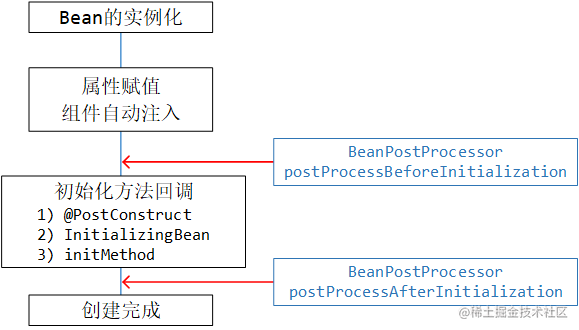
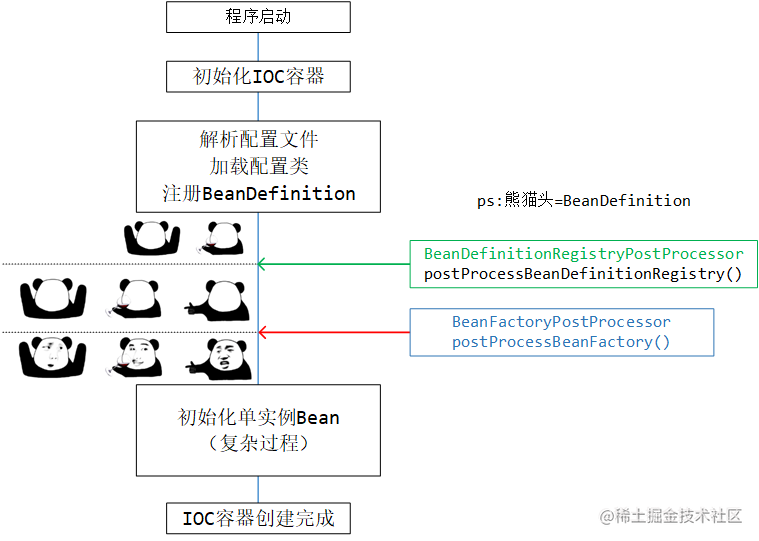
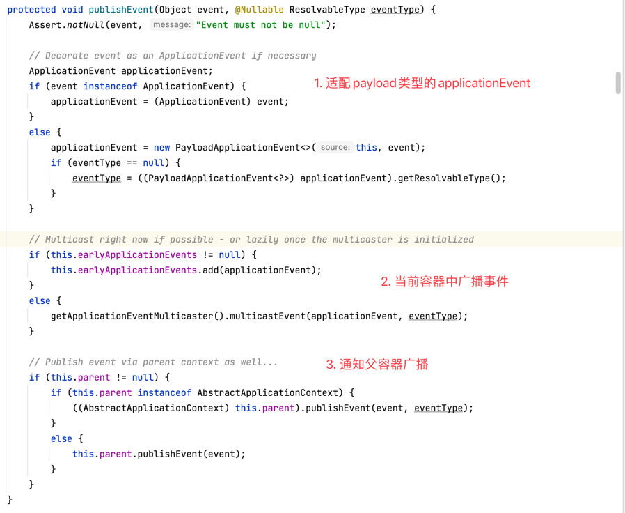

## ioc_high
### 1. Environment


- `Environment`中包含profiles和properties, 这些配置信息会影响IOC容器中bean的注册与创建
- `Environment`的创建是在`ApplicationContext`创建后才创建的，所以Environment应该是伴随着ApplicationContext的存在而存在
- `ApplicationContext`中同时包含 `Environment` 和`组件 bean` ，
  而且从 `BeanFactory` 的视角来看，Environment 也是一个 Bean ，只不过它的地位比较特殊

**Environment是SpringFramework中的抽象概念，它包含** `profiles` **和** `properties` **的信息，使用** `profiles`**实现不同环境的Bean装配，**
**使用** `properties` **来做外部化配置，为组件注入属性值。**

#### 1.1 Environment的结构


- **PropertyResolver**: 可以获取配置元信息，同时也可以解析占位符的信息
- **ConfigurableEnvironment**: 扩展了set方法 (Configurable... 可写)
- **StandardEnvironment**: SpringFramework 中默认使用的标准运行时环境的实现

#### 1.2 Environment中关于profiles的原理

底层是个`Set<String>` 默认情况下定义为`default`，
我们可以根据`spring.profiles.default`和`spring.profiles.active`来定义默认和生效的profile。

#### 1.3 Environment中解析properties的底层

查看`getProperty方法`，可以在`AbstractEnvironment`发现它组合了一个`ConfigurablePropertyResolver`

```java
private final ConfigurablePropertyResolver propertyResolver = 
        new PropertySourcesPropertyResolver(this.propertySources);
```
**专业的事情交给专业的人做**，我们称这种方式叫做 **“委派”** ，
它与代理、装饰者不同：**委派仅仅是将方法的执行转移给另一个对象**，而**代理**可能会在此做**额外的处理**，**装饰者**也会**在方法执行前后做增强**。

### 2. BeanDefinition
#### 2.1 对BeanDefinition的理解

`BeanDefinition`描述了 SpringFramework 中 bean 的**元信息**，
它包含 bean 的**类信息（全限定类名）**、**属性（作用域、是否默认、描述信息）**、**行为（是否延迟加载、是否自动注入、初始化和销毁方法）**、
**依赖关系**、**配置属性（构造器参数、属性）**等。
`BeanDefinition` 具有**层次性**，并且可以在 IOC 容器初始化阶段被 `BeanDefinitionRegistryPostProcessor` 构造和注册，
被 `BeanFactoryPostProcessor` 拦截修改等

#### 2.2 BeanDefinition的结构


##### 2.2.1 AttributeAccessor

`BeanDefinition` 实现了 `AttributeAccessor 接口`，**具有配置 bean 属性的功能(包括访问、修改和移除等操作)**

##### 2.2.2 AbstractBeanDefinition

基本上它包含了上边提到的信息，但是还是省略了一些常用属性。

##### 2.2.3 GenericBeanDefinition

`GenericBeanDefinition`实现了抽象类`AbstractBeanDefinition`，多了一个`parentName`，相比多了**层次性**（能从父BeanDefinition继承一些属性信息）

##### 2.2.4 RootBeanDefinition与ChildBeanDefinition

`ChildBeanDefinition`和`GenericBeanDefinition`很像，但是它没有默认的无参构造器

`RootBeanDefinition`只能单独出现或作为**父BeanDefinition**出现，不能继承其他的`BeanDefinition`，
它比`AbstractBeanDefinition`多了一些Bean的**id和别名**，**注解**和**工厂Bean信息**

#### 2.3 BeanDefinition是如何生成的

1. 通过**xml加载的BeanDefinition**，它的读取工具是`XmlBeanDefinitionReader`，它会解析xml配置文件，最终在`DefaultBeanDefinitionDocumentReader`
   的`doRegisterBeanDefinitions方法`下，创建`BeanDefinition`
2. 通过**注解和组件扫描构造的BeanDefinition**，它的扫描工具是`ClassPathBeanDefinitionScanner`，
   调用`doScan核心方法`，创建`ScannedGenericBeanDefinition`并返回
3. **配置类和@Bean注解构造的BeanDefinition**最复杂，最终创建出`ConfigurationClassBeanDefinition`返回

#### 2.4 对BeanDefinition的理解

它像我们平时编**写 Class 再 new 出对象一样**，`SpringFramework`面对一个应用程序，
它也需要对其中的 bean 进行定义抽取，**只有抽取成可以统一类型 / 格式的模型，才能对后续的 bean 对象进行统一管理**，
也或者是对特定的 bean 进行特殊化的处理。而这一切的一切，最终**落地到统一类型上，就是 BeanDefinition 这个抽象化的模型**

### 3. BeanDefinitionRegistry

在SpringFramework中，`BeanDefinitionRegistry`的实现是`DefaultListableBeanFactory`，它在内部存放了`BeanDefinition`，
是`BeanDefinition`的**注册中心**，支持对`BeanDefinition`的**增删查操作**。

### 4. BeanPostProcessor
`BeanPostProcessor` 是一个**回调机制的扩展点**，它的核心工作点是在 bean 的**初始化前后**做一些额外的处理，
通过实现`Ordered接口`来控制后置处理器的先后顺序，`BeanPostProcessor`**只对当前IOC容器起作用**，**不影响其他 IOC 容器中的Bean**。
如果要对`BeanDefinition`进行处理，需要使用`BeanFactoryPostProcessor`。

所谓**初始化前后**`BeanPostProcessor`的执行时机



#### 4.1 InstantiationAwareBeanPostProcessor


它有两个作用：

- **拦截并替换Bean的实例化动作**
- **拦截Bean的属性注入**

接口中的方法体现以上两个作用：

- `postProcessBeforeInstantiation`: **拦截 bean 原本的实例化方法，转为用这里的实例化**
- `postProcessAfterInstantiation`: **这个方法返回Boolean值，控制** `postProcessProperties` **方法的执行， 
  返回false不执行**`postProcessProperties`方法
- `postProcessProperties`: **在属性赋值之前触发，该方法返回键值对参与bean的赋值**

在生命周期中的体现


### 5. BeanFactoryPostProcessor

`BeanFactoryPostProcessor`针对的是`BeanDefinition`，**可以在 bean 实例的初始化之前修改定义信息**，
**也就是在所有BeanDefinition都注册到BeanFactory后回调，**
**所有 bean 在没有实例化之前都是以 BeanDefinition 的形式存在**，
如果提前修改了 BeanDefinition ，那么在 bean 的实例化时，最终创建出的 bean 就会受到影响。

它的作用时机如下图


#### 5.1 BeanDefinitionRegistryPostProcessor

`BeanDefinitionRegistryPostProcessor` **在IOC容器将所有`BeanDefinition`都准备好时执行回调，用于注册新的** `BeanDefinition`，
它的执行时机在`BeanFactoryPostProcessor`之前，也就是说注册完BeanDefinition之后，还可以使用`BeanFactoryPostProcessor`对其进行修改。



### 6. SPI
**依赖倒转原则**中提到: **应该依赖接口而不是实现类**，但接口最终要有实现类落地。

`SPI`通过一种 **“服务寻找”的机制** ，**动态的加载接口 / 抽象类对应的具体实现类**，并把接口具体实现类的定义和声明权交给了**外部化的配置文件**。
（SPI的全称是 Service Provider Interface 服务提供接口）

下图是SPI的形象体现


#### 6.1 SpringFramework 中的 SPI

它**不仅仅局限于接口 / 抽象类**，它**可以是任何一个类、接口、注解**。
也正是因为可以**支持注解的 SPI** ，这个特性在SpringBoot中被疯狂利用（如`@EnableAutoConfiguration`）

配置的`properties`必须放在`META-INF`目录下，且文件名必须为 `spring.factories`。
借助`SpringFactoriesLoader`可以加载该配置，根据需要调用`loadFactories`或`loadFactoryNames`解析出想要的**实现类**或**实现类的全限定名**

### 7. 事件和监听器

子容器的事件会**向上传播到父容器**，父容器的事件**不会**向下传播

#### 7.1 原理
`ApplicationEventPublisher` 和 `ApplicationEventMulticaster`分别代表事件的**发布器**和**广播器**，**事件发布器用来接受事件，
并交给广播器来处理**，**事件广播器拿到事件后，广播给监听器**，对应到观察者模式，观察者就相当于是**发布器**和**广播器**，订阅者相当于是**监听器**

看事件发布方法的源码，如下，可以知道**为什么事件会向父容器广播**



我们再注意关注一下在本容器中广播事件，调用`ApplicationEventMulticaster`广播器的`multicastEvent方法`，
点到里边儿会发现使用了**双检锁 + 缓存**的形式来来获取所有的**监听器**， 最后会执行监听器的`onApplicationEvent方法`
