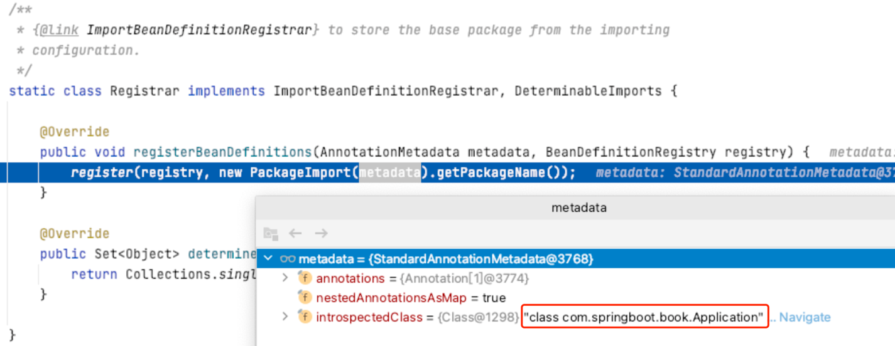

## @SpringBootApplication

它是 `@SpringBootConfiguration`、 `@EnableAutoConfiguration` 和 `@ComponentScan` 的组合注解，它能**启动自动装配和进行组件扫描**

### @ComponentScan

**指定包扫描的根路径，如果没有指定路径，那么则扫描 `@SpringBootApplication` 所在包及其子路径**

#### @ComponentScan的excludeFilters属性

用于指定过滤器，将不需要扫描的 bean 排除。默认指定了两个过滤器 `TypeExcludeFilter` 和 `AutoConfigurationExcludeFilter`

##### TypeExcludeFilter

**它提供的是扩展机制，用于对bean的过滤**

注意其中的`match()`方法，将所有TypeExcludeFilter类型的过滤器都取了出来，并依次执行`match()`方法判断是否需要过滤

```java
	@Override
	public boolean match(MetadataReader metadataReader, MetadataReaderFactory metadataReaderFactory)
			throws IOException {
		if (this.beanFactory instanceof ListableBeanFactory && getClass() == TypeExcludeFilter.class) {
		    // 取出所有类型的TypeExcludeFilter
			Collection<TypeExcludeFilter> delegates = ((ListableBeanFactory) this.beanFactory)
                    .getBeansOfType(TypeExcludeFilter.class).values();
			
			// 依次执行match()方法判断过滤
			for (TypeExcludeFilter delegate : delegates) {
				if (delegate.match(metadataReader, metadataReaderFactory)) {
					return true;
				}
			}
		}
		
		return false;
	}
```

##### AutoConfigurationExcludeFilter

顾名思义，自动配置bean的过滤器，它其中有两个方法表示得很明确，如果满足两个条件的话，将该 配置bean 过滤掉

```java
    // 判断是否是被 @Configuration 标注的配置bean
	private boolean isConfiguration(MetadataReader metadataReader) {
		return metadataReader.getAnnotationMetadata().isAnnotated(Configuration.class.getName());
	}

	// 判断是否是自动装配的配置bean
	private boolean isAutoConfiguration(MetadataReader metadataReader) {
		return getAutoConfigurations().contains(metadataReader.getClassMetadata().getClassName());
	}

    protected List<String> getAutoConfigurations() {
        if (this.autoConfigurations == null) {
            this.autoConfigurations = SpringFactoriesLoader.loadFactoryNames(EnableAutoConfiguration.class, this.beanClassLoader);
        }
        return this.autoConfigurations;
    }
```

### @SpringBootConfiguration

它没有特别的意义，相当于是**主启动类专用注解**，和`@Configuration`相比没有本质上的区别

### @EnableAutoConfiguration

它也是组合注解，包含 `@AutoConfigurationPackage` 注解和组件注入了 `@Import(AutoConfigurationImportSelector.class)`，
它的作用是**启用Spring的自动装配**

#### @AutoConfigurationPackage

- **获取自动装配的包路径**

这个注解通过模块装配 `@Import(AutoConfigurationPackages.Registrar.class)` 装配了 `Registrar`，而 `Registrar` 的javadoc中提到:
用于保存 `base package` 基础路径，也就是说，**在 @ComponentScan 中提到的没有指定扫描路径时，则会扫描启动类所在路径及其子路径**的实现是在这里做的。
Debug看其中的方法如下，可以发现 `metadata` 就是我们的启动类，通过它获取到了根路径



之后调用 `register()` 方法，目的是将 `base package` 保存起来供之后使用。
在javadoc中有提到: 可以直接调用该方法手动注册根路径，但是并不推荐这么做，还是以启动类所在的路径作为根路径最好


`base package` **用于在整合第三方组件时，通过获取到该路径并在该路径下扫描需要的 bean**

以 `mybatis-spring-boot-starter` 依赖为例，可以在其中发现如下代码，其中获取了 `base package`，并在该路径下搜寻被 `@Mapper` 修饰的bean

```java
public static class AutoConfiguredMapperScannerRegistrar implements BeanFactoryAware, ImportBeanDefinitionRegistrar {

    private BeanFactory beanFactory;

    @Override
    public void registerBeanDefinitions(AnnotationMetadata importingClassMetadata, BeanDefinitionRegistry registry) {
        if (!AutoConfigurationPackages.has(this.beanFactory)) {
            logger.debug("Could not determine auto-configuration package, automatic mapper scanning disabled.");
            return;
        }
        logger.debug("Searching for mappers annotated with @Mapper");

        // !!获取base package!!
        List<String> packages = AutoConfigurationPackages.get(this.beanFactory);
        // logger ......
        // 注册Mapper ......
    }
}
```

#### @Import(AutoConfigurationImportSelector.class)

- **通过SPI加载出所有自动装配bean，装配到IOC容器中**

#### AutoConfigurationImportSelector

借助 `DeferredImportSelector` 去处理自动装配，它是一个接口，并且需要注意 `Deferred` 的意思是延迟，再结合它的javadoc内容

> 它会在所有的 bean （被@Configuration, @Bean, @Component等） 处理完成后，再处理被 @Conditional 注解修饰的 bean

正好解释了"延迟"的意思，用它来处理自动装配，也预示着自动装配的bean被 `@Conditional` 及相关注解修饰

其中有 `process()` 方法，随着方法调用最终会借助 `SpringFactoriesLoader` 加载 `spring-boot-autoconfigure` 包 `META-INF` 目录下的 `spring.factories` 文件，
这个文件中我们可以发现以 `@EnableAutoConfiguration` 注解为key，很多以 `XXXAutoConfiguration` 结尾的bean为values的内容，如下


这里是对 `SPI` 服务寻找的应用，在Spring中支持以注解作为key的键值对（不局限于接口和抽象类），
那么便可以通过 `@EnableAutoConfiguration` 注解寻找到所有自动装配类，配置的properties必须放在 `META-INF` 目录下，且文件名必须为 `spring.factories`
