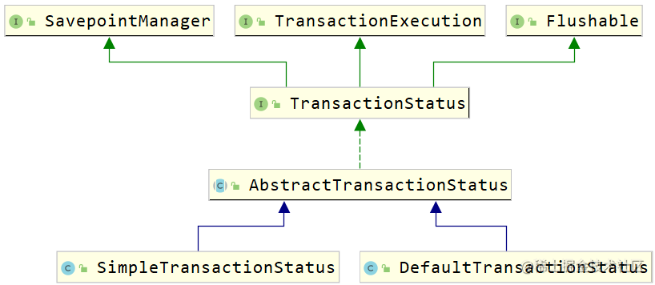

## [《从0开始深入学习Spring》](https://s.juejin.cn/ds/YGA3GYc/) ，点击查看原书

Spring是一个开源的企业级Java开发框架，可以更容易的构建出Java应用，
并且可以根据应用开发的组件需要进行整合（容器：管理应用中使用的组件Bean、托管Bean的生命周期、事件与监听器的驱动），
它的核心是IOC和AOP，它的强大之处还体现在对事务的控制上。

在 SpringFramework 的框架编码中，如果有出现一个方法是 **do 开头**，**并且去掉 do 后能找到一个与剩余名称一样的方法**，
则代表如下含义：**不带 do 开头的方法一般负责前置校验处理、返回结果封装**，**带 do 开头的方法是真正执行逻辑的方法**
（ 如 getBean 方法的底层会调用 doGetBean 来真正的寻找 IOC 容器的 bean ，createBean 会调用 doCreateBean 来真正的创建一个 bean ）。

## ioc_origin
### 1. Bean的生命周期总览


#### 1.1 BeanDefinition

`BeanDefinition` 都构造好之后，是不会立即注册到 `BeanFactory` 的，
这中间有一步执行 `BeanDefinitionRegistryPostProcessor` 的**注册新的Bean的动作**，
等这些 `BeanDefinitionRegistryPostProcessor` 都执行完 `postProcessBeanDefinitionRegistry` 方法后，
`BeanDefinition` 才会注册到 `BeanFactory`


这个动作之后，下一步则是执行 `BeanFactoryPostProcessor` 的 `postProcessBeanFactory` 方法 **修改BeanDefinition配置信息**，
添加注入的依赖项，给属性赋值等操作。


这下之后，`BeanDefinition` 就不再改变了，宣告 `BeanDefinition` 的阶段结束

#### 1.2 Bean实例阶段内容


Bean初始化完成后即进入**运行期使用阶段**，使用完进入**销毁阶段**


### 2. BeanDefinition阶段细则！
#### 2.1 xml配置文件的BeanDefinition的加载

`ClassPathXmlApplicationContext`执行refresh方法，借助`XmlBeanDefinitionReader`**读取xml配置文件**，
之后借助`DefaultBeanDefinitionDocumentReader`**解析xml配置文件**，将`<bean>`标签封装成`BeanDefinition`，注册到`BeanDefinitionRegistry`中

在`BeanDefinitionRegistry`中是以Map的形式保存，**key: beanName, value: beanDefinition**, 
beanName没有在BeanDefinition中保存，而是**封装在了BeanDefinitionHolder中**，**要不然beanName就拿不到了**

#### 2.2 注解配置类的BeanDefinition的加载

注解配置类的解析发生在 `ApplicationContext` 中 `refresh`方法的 `BeanDefinitionRegistryPostProcessor` 的执行阶段，
它对应的**核心后置处理器**是 `ConfigurationClassPostProcessor` ，执行 `postProcessBeanDefinitionRegistry`方法，
来**解析配置类**和**注册BeanDefinition**。使用`ClassPathBeanDefinitionScanner`实现包扫描的BeanDefinition封装，
使用`ConfigurationClassBeanDefinitionReader`实现`@Bean`注解的`BeanDefinition`封装，最后封装到 `BeanDefinitionRegistry` 中

- `ConfigurationClassPostProcessor`会先后处理`@Component`注解、`@PropertySource`注解、`@ComponentScan`注解、`@Import`注解、
`@ImportResource`注解、`@Bean`注解

### 3. Bean的实例化阶段

关注 refresh 方法中第六行**注册BeanPostProcessor** `registerBeanPostProcessors(beanFactory);` 
和第十一行**初始化非懒加载的单例Bean** `finishBeanFactoryInitialization(beanFactory);`

#### 3.1 BeanPostProcessor

- **BeanPostProcessorChecker**



如果遇到了图上的日志，就是**BeanPostProcessorChecker**的作用。它会检查在 `BeanPostProcessor`**的初始化阶段中是否有 bean 的意外创建**，
例如在我们的例子中，在创建后置处理器`LifecyclePostProcessor`时需要创建`LifecycleBeanConfiguration`，
它在**后置处理器创建之前就创建好了**， 那么这个**普通的配置Bean**就没来得及被 `BeanPostProcessor`处理，所以会提示这个信息来让开发者注意

- **为什么注册BeanPostProcessor时有先后顺序，为什么会先注册实现了PriorityOrdered接口的BeanPostProcessor**

因为优先级低的 `BeanPostProcessor` 可能也需要被优先级高的 `BeanPostProcessor` 处理，如果没有先后顺序的话，
那么低优先级会干预了优先级高的 `BeanPostProcessor`

（可以想想老大老二老三的故事...）


像实现了 `PriorityOrdered` 接口的 `AutowiredAnnotationBeanPostProcessor` 用来处理 **@Autowired注解** ，
`CommonAnnotationBeanPostProcessor` 用来处理**JSR250 规范的注解**，这些都是核心的内部组件，必须先让它们正常到位才行

#### 3.2 真正的bean的实例化

在 **refresh方法**的第十一步，`finishBeanFactoryInitialization(beanFactory)`，此时会初始化**所有的非懒加载的单例bean**，
实例化bean的入口方式是 **getBean**, **doGetBean**, 这个阶段会**合并BeanDefinition**，**根据bean的定义域来选择bean的实例化策略**。
之后创建Bean会走**createBean方法**，它会先执行**后置处理器InstantiationAwareBeanPostProcessor**来尝试创建Bean，
如果创建成功执行`postProcessAfterInitialization 方法`初始化 bean 后返回，否则它会执行**doCreateBean方法** **根据构造器来去创建bean对象**

- **合并BeanDefinition**
调用的是`getMergedLocalBeanDefinition`方法，在方法中它会**自下而上递归寻找父BeanDefinition**，**再从上到下合并**，
  最终返回 `BeanDefinition`，**根据合并后的BeanDefinition对Bean进行依赖注入**

- **注解配置类中被 @Bean 标注的方法**，本质上调用工厂方法实例bean

### 4. Bean的初始化阶段

#### 4.1 doCreateBean


在doCreateBean方法中有如上一步，**修改合并后的BeanDefinition**，涉及的后置处理器是如下三个

- **InitDestroyAnnotationBeanPostProcessor**: 收集标注了 `@PostConstruct` 和 `@PreDestroy` 注解的后置处理器
- **CommonAnnotationBeanPostProcessor**: 收集了 `@Resource` 注解的后置处理器
- **AutowiredAnnotationBeanPostProcessor**: `@Autowired` 注解 `@Value` 注解，
  如果 classpath 下有来自 JSR 330 的 `@Inject` 注解，也会一并支持


这一步解决bean的循环依赖，**此时bean的实例已经存在了，只不过没有进行属性赋值和依赖注入，** 在此时又有bean需要创建它时，
不会再去重新创建同样的bean对象，而是直接拿到它的引用

---

## ioc_high
### 1. Environment


- `Environment`中包含profiles和properties, 这些配置信息会影响IOC容器中bean的注册与创建
- `Environment`的创建是在`ApplicationContext`创建后才创建的，所以Environment应该是伴随着ApplicationContext的存在而存在
- `ApplicationContext`中同时包含 `Environment` 和`组件 bean` ，
而且从 `BeanFactory` 的视角来看，Environment 也是一个 Bean ，只不过它的地位比较特殊

**Environment是SpringFramework中的抽象概念，它包含** `profiles` **和** `properties` **的信息，使用** `profiles`**实现不同环境的Bean装配，**
**使用** `properties` **来做外部化配置，为组件注入属性值。**

#### 1.1 Environment的结构


- **PropertyResolver**: 可以获取配置元信息，同时也可以解析占位符的信息
- **ConfigurableEnvironment**: 扩展了set方法，Configurable... 可写
- **StandardEnvironment**: SpringFramework 中默认使用的标准运行时环境的实现

#### 1.2 Environment中关于profiles的原理

底层是个`Set<String>` 默认情况下定义为`default`，
我们可以根据`spring.profiles.default`和`spring.profiles.active`来定义默认和生效的profile。

#### 1.3 Environment中解析properties的底层

查看`getProperty方法`，可以在`AbstractEnvironment`发现它组合了一个`ConfigurablePropertyResolver`

```java
private final ConfigurablePropertyResolver propertyResolver = 
        new PropertySourcesPropertyResolver(this.propertySources);
```
**专业的事情交给专业的人做**，我们称这种方式叫做 **“委派”** ，
它与代理、装饰者不同：**委派仅仅是将方法的执行转移给另一个对象**，而**代理**可能会在此做**额外的处理**，**装饰者**也会**在方法执行前后做增强**。

### 2. BeanDefinition
#### 2.1 对BeanDefinition的理解

`BeanDefinition`描述了 SpringFramework 中 bean 的**元信息**，
它包含 bean 的**类信息（全限定类名）**、**属性（作用域、是否默认、描述信息）**、**行为（是否延迟加载、是否自动注入、初始化和销毁方法）**、
**依赖关系**、**配置属性（构造器参数、属性）**等。
`BeanDefinition` 具有**层次性**，并且可以在 IOC 容器初始化阶段被 `BeanDefinitionRegistryPostProcessor` 构造和注册，
被 `BeanFactoryPostProcessor` 拦截修改等

#### 2.2 BeanDefinition的结构


##### 2.2.1 AttributeAccessor

`BeanDefinition` 实现了 `AttributeAccessor 接口`，**具有配置 bean 属性的功能(包括访问、修改和移除等操作)**

##### 2.2.2 AbstractBeanDefinition

基本上它包含了上边提到的信息，但是还是省略了一些常用属性。

##### 2.2.3 GenericBeanDefinition

`GenericBeanDefinition`实现了抽象类`AbstractBeanDefinition`，多了一个`parentName`，相比多了**层次性**（能从父BeanDefinition继承一些属性信息）

##### 2.2.4 RootBeanDefinition与ChildBeanDefinition

`ChildBeanDefinition`和`GenericBeanDefinition`很像，但是它没有默认的无参构造器

`RootBeanDefinition`只能单独出现或作为**父BeanDefinition**出现，不能继承其他的`BeanDefinition`，
它比`AbstractBeanDefinition`多了一些Bean的**id和别名**，**注解**和**工厂Bean信息**

#### 2.3 BeanDefinition是如何生成的

1. 通过**xml加载的BeanDefinition**，它的读取工具是`XmlBeanDefinitionReader`，它会解析xml配置文件，最终在`DefaultBeanDefinitionDocumentReader`
的`doRegisterBeanDefinitions方法`下，创建BeanDefinition
2. 通过**注解和组件扫描构造的BeanDefinition**，它的扫描工具是`ClassPathBeanDefinitionScanner`，
调用`doScan核心方法`，创建`ScannedGenericBeanDefinition`并返回
3. **配置类和@Bean注解构造的BeanDefinition**最复杂，最终创建出`ConfigurationClassBeanDefinition`返回

#### 2.4 对BeanDefinition的理解

它像我们平时编**写 Class 再 new 出对象一样**，`SpringFramework`面对一个应用程序，
它也需要对其中的 bean 进行定义抽取，**只有抽取成可以统一类型 / 格式的模型，才能在后续的 bean 对象管理时，进行统一管理**，
也或者是对特定的 bean 进行特殊化的处理。而这一切的一切，最终**落地到统一类型上，就是 BeanDefinition 这个抽象化的模型**

### 3. BeanDefinitionRegistry

在SpringFramework中，`BeanDefinitionRegistry`的实现是`DefaultListableBeanFactory`，它在内部存放了`BeanDefinition`，
是`BeanDefinition`的**注册中心**，支持对`BeanDefinition`的**增删查操作**。

### 4. BeanPostProcessor
`BeanPostProcessor` 是一个**回调机制的扩展点**，它的核心工作点是在 bean 的**初始化前后**做一些额外的处理，
通过实现`Ordered接口`来控制后置处理器的先后顺序，`BeanPostProcessor`**只对当前IOC容器起作用**，**不影响其他 IOC 容器中的Bean**。
如果要对`BeanDefinition`进行处理，需要使用`BeanFactoryPostProcessor`。

所谓**初始化前后**`BeanPostProcessor`的执行时机


#### 4.1 InstantiationAwareBeanPostProcessor


它有两个作用：

- **拦截并替换Bean的实例化动作**
- **拦截Bean的属性注入**

接口中的方法体现以上两个作用：

- `postProcessBeforeInstantiation`: **拦截 bean 原本的实例化方法，转为用这里的实例化**
- `postProcessProperties`: **在属性赋值之前触发，该方法返回键值对参与bean的赋值**
- `postProcessAfterInstantiation`: **这个方法返回Boolean值，控制** `postProcessProperties` **方法的执行，
返回false不执行**`postProcessProperties`方法

在生命周期中的体现


### 5. BeanFactoryPostProcessor

`BeanFactoryPostProcessor`针对的是`BeanDefinition`，**可以在 bean 实例的初始化之前修改定义信息**，
**也就是在所有BeanDefinition都注册到BeanFactory后回调，**
**所有 bean 在没有实例化之前都是以 BeanDefinition 的形式存在**，
如果提前修改了 BeanDefinition ，那么在 bean 的实例化时，最终创建出的 bean 就会受到影响。

它的作用时机如下图


#### 5.1 BeanDefinitionRegistryPostProcessor

`BeanDefinitionRegistryPostProcessor` **在IOC容器将所有`BeanDefinition`都准备好时执行回调，用于注册新的** `BeanDefinition`，
它的执行时机在`BeanFactoryPostProcessor`之前，也就是说注册完BeanDefinition之后，还可以使用`BeanFactoryPostProcessor`对其进行修改。


### 6. SPI
**依赖倒转原则**中提到: **应该依赖接口而不是实现类**，但接口最终要有实现类落地。

`SPI`通过一种 **“服务寻找”的机制** ，**动态的加载接口 / 抽象类对应的具体实现类**，并把接口具体实现类的定义和声明权交给了**外部化的配置文件**。
（SPI的全称是 Service Provider Interface 服务提供接口）

下图是SPI的形象体现


#### 6.1 SpringFramework 中的 SPI

它**不仅仅局限于接口 / 抽象类**，它**可以是任何一个类、接口、注解**。
也正是因为可以**支持注解的 SPI** ，这个特性在SpringBoot中被疯狂利用（如`@EnableAutoConfiguration`）

配置的`properties`必须放在`META-INF`目录下，且文件名必须为 `spring.factories`。
借助`SpringFactoriesLoader`可以加载该配置，根据需要调用`loadFactories`或`loadFactoryNames`解析出想要的**实现类**或**实现类的全限定名**

### 7. 事件和监听器

子容器的事件会**向上传播到父容器**，父容器的事件**不会**向下传播

#### 7.1 原理
`ApplicationEventPublisher` 和 `ApplicationEventMulticaster`分别代表事件的**发布器**和**广播器**，**事件发布器用来接受事件，
并交给广播器来处理**，**事件广播器拿到事件后，广播给监听器**，对应到观察者模式，观察者就相当于是**发布器**和**广播器**，订阅者相当于是**监听器**

看事件发布方法的源码，如下，可以知道**为什么事件会向父容器广播**


我们再注意关注一下在本容器中广播事件，调用`ApplicationEventMulticaster`广播器的`multicastEvent方法`，
点到里边儿会发现使用了**双检锁 + 缓存**的形式来来获取所有的**监听器**， 最后会执行监听器的`onApplicationEvent方法`

---

## ioc_medium


### 1. BeanFactory和它的子接口们

BeanFactory的基础特性：

- **最基础的容器**
- **定义了作用域的概念**
- **集成环境配置**：它本身是所有 Bean 的注册中心，所有的 Bean 最终都在BeanFactory中创建和保存。
另外 BeanFactory 中还集成了配置信息，咱通过加载外部的 properties 文件，借助 SpringFramework 的方式将配置文件的属性值设置到 Bean 对象中。
- **支持多种类型的配置源**
- **完整的生命周期控制机制**
- **层次性的设计**：可以支持**父子结构**，由HierarchicalBeanFactory实现

#### 1.1 HierarchicalBeanFactory

实现BeanFactory的子接口，它可以理解为是层次结构的一部分。
可以在 `ConfigurableBeanFactory` 接口中找到用于 BeanFactory 的相应 `setParentBeanFactory` 方法，该方法允许以可配置的方式设置父对象

如果当前容器中找不到就往上找，那如果找到了就不往上找了。但是**如果当前 BeanFactory 中有指定的 Bean 了，父 BeanFactory 中可能有吗**？

**答案是有，因为即便存在父子关系，但他们本质上是不同的容器，所以有可能找到多个相同的 Bean 。**
换句话说，@Scope 中声明的 Singleton 只是在一个容器中是单实例的，但有了层次性结构后，对于整体的多个容器来看，就不是单实例的了。

#### 1.2 ListableBeanFactory

它的扩展功能是能让咱在拿到 BeanFactory 时可以直接把容器中的所有 Bean 都拿出来，但是它列举的仅仅是**当前容器中的Bean**

（可以看IOCMediumApplication中的代码例子）

#### 1.3 ConfigurableBeanFactory

`Configurable` **开头**的 BeanFactory 或者 ApplicationContext 就具有了 set（可写）的操作，
可以调用里边儿的定义的方法对BeanFactory进行修改和扩展等，但是它不推荐给开发者使用，因为在程序运行期间不应该对BeanFactory进行频繁的变动。

### 2. BeanFactory的实现类们

#### 2.1 AbstractBeanFactory

它是BeanFactory**最基础的抽象实现类，具有基础的功能**，此外它还扩展了一些功能：别名的处理（来源于 AliasRegistry 接口）、
Bean 定义的合并、Bean 的销毁动作支持等，而且它还定义了模板方法`getBeanDefinition` 和 `createBean`

#### 2.2 AbstractAutowireCapableBeanFactory

它提供Bean的创建逻辑实现，具有**Bean 的创建**、**属性填充和依赖的自动注入**、**Bean 的初始化**功能。

它有`resolveDependency(DependencyDescriptor, String, Set, TypeConverter)`模板方法，具有解析Bean的成员中定义的属性依赖关系，
但是**不负责**BeanDefinition的注册。

#### 2.3 DefaultListableBeanFactory

DefaultListableBeanFactory是BeanFactory的最终默认实现，它的作用是**先注册 Bean 的定义信息(BeanDefinitionRegistry)，
再完成 Bean 的创建和初始化动作(AbstractAutowireCapableBeanFactory)**

### 3. ApplicationContext和它的上下辈们


Application是Spring中最核心的接口，在BeanFactory基础上扩展了**生命周期管理**，**Bean和BeanFactory的后置处理器**，**国际化**以及**事件发布机制**。

继承`ListableBeanFactory`可以访问应用程序中的组件Bean，继承`ResourceLoader`能加载文件资源，
继承`ApplicationEventPublisher`实现事件的发布和监听机制，继承`MessageSource`实现国际化，继承`HierarchicalBeanFactory`以支持父子上下文。

#### 3.1 ConfigurableApplicationContext

注意它也是`Configurable`开头的，那么它会提供 **"可写"** 的功能，为ApplicationContext添加了配置的功能，它有定义**指定父容器**，**Environment**，
**BeanFactory的后置处理器**的方法等

#### 3.2 EnvironmentCapable

在 SpringFramework 中，**以 Capable 结尾的接口**，**通常意味着可以通过这个接口的某个特定的方法（通常是 `getXXX()` ）拿到特定的组件。**
Application实现了这个接口，那么它能拿到`Environment`对象。

我们可以这么理解，Spring的应用在运行时包含两部分：**应用程序本身**和**应用程序运行时的环境**。`Environment`就类似于**运行环境的抽象对象**，
它内部保存着一些程序运行的配置。

### 4. ApplicationContext的实现类们


#### 4.1 AbstractApplicationContext

它是Application中最核心的实现类，没有之一。它定义和实现了**绝大部分应用上下文的特性和功能**。

使用了模板方法模式，实际的动作由子类去实现。直接继承了`DefaultResourceLoader`，提供默认的加载资源文件策略，从classpath下加载。

#### 4.2 AbstractXmlApplicationContext

它是最终 `ClassPathXmlApplicationContext` 和 `FileSystemXmlApplicationContext` 的直接父类，已**具备全部基本功能**。
根据子类不同的配置文件，实现`getConfigResources` 和/或 `getConfigLocations` 方法即可。

#### 4.3 ClassPathXmlApplicationContext

它是一个最终落地实现，对classpath下的xml文件进行加载，如果有多个配置，它解析配置文件有先后之分，
较新的BeanDefinition会覆盖掉之前的BeanDefinition。

#### 4.4 AnnotationConfigApplicationContext

它继承了`GenericApplicationContext` ，那自然它也只能刷新一次(因为GenericApplicationContext只能刷新(`refresh()方法`)一次)，
注解驱动的IOC容器。

它也有配置覆盖的概念，如果有多个 `@Configuration` 类，则在以后的类中定义的 `@Bean` 方法将覆盖在先前的类中定义的方法。
这可以通过一个额外的 `@Configuration` 类来故意覆盖某些 `BeanDefinition`。

它可以配合`XmlBeanDefinitionReader`，这样就能够注解驱动和xml配置通吃了。

### 5. 事件机制
#### 5.1 观察者模式
观察者模式也被称为**发布订阅模式**，被观察的对象做出**某些动作**，**会自动通知到它的订阅者**。它的三大核心是：**观察者，被观察的主题，订阅者。**
观察者需要绑定要通知的订阅者，并且要观察指定的主题。

在Spring中体现观察者模式的就是**事件驱动和监听器**，**监听器（Listener）对应订阅者**，事件源充当被观察的主题，用来发布事件，
**IOC容器本身也是事件广播器，可以理解为观察者。** 可根据下图继续理解


#### 5.2 了解Spring内置事件

Spring容器内置事件

- **ContextRefreshedEvent**:  IOC容器刷新完毕但尚未启动，所有单实例 Bean 刚创建完
- **ContextClosedEvent**: IOC容器已经关闭但尚未销毁所有Bean
- **ContextStartedEvent**
- **ContextClosedEvent** 

我们点击以上任意一个事件，都是根据`ApplicationContextEvent`进行扩展的，如下


#### 5.3 自定义事件
实现ApplicationEvent来自定义事件（直接实现它并没有太大意义，更像是具体业务的触发时机），创建对应事件的监听器，在其中完成想要的业务

### 6. 模块装配

模块装配就是**把一个功能模块需要的核心功能组件都装配好**，它的核心原则是：**自定义注解搭配@Import导入需要的组件。**
类似一些常见的`@Enablexxx`

四种模块装配的方式(以`@EnableTavern`注解为例)
- 导入普通类（`Boss`）
- 导入配置类（`BartenderConfiguration`）
- 导入ImportSelector（`BarImportSelector`）
- 导入ImportBeanDefinitionRegistrar（`WaiterRegister`）

### 7. 条件装配
#### 7.1 profile
可以通过使用`@Profile`注解来指定配置文件条件注入想要的bean.

#### 7.2 condition
使用`@Conditional`注解，并创建条件类实现Condition接口来定义条件注入的规则

### 8. 组件扫描
#### 8.1 ComponentScan的basePackageClasses参数
这个参数指定多个类，扫描的范围是该类所在的包及其子包下的所有Bean，
它的**默认扫描规则**是对以 `@Component` 、`@Repository` 、`@Service` 或 `@Controller` 注解的类的自动检测。

#### 8.2 exclude

```java
@Configuration
@ComponentScan(
        basePackageClasses = Red.class,
        excludeFilters = @ComponentScan.Filter(type = FilterType.ANNOTATION, value = Animal.class))
public class BasePackageClassConfiguration {
}
```

定义排除Animal注解的Bean，扫描范围如下


#### 8.3 include

```java
@Configuration
@ComponentScan(
        basePackageClasses = Red.class,
        excludeFilters = @ComponentScan.Filter(type = FilterType.ANNOTATION, value = Animal.class),
        includeFilters = @ComponentScan.Filter(type = FilterType.ANNOTATION, value = Color.class))
public class BasePackageClassConfiguration {
}
```

定义包含`Color`注解的Bean，即便没有在Black的类上添加Component注解，添加上了Color注解也是能扫描的

```java
@Color
public class Black {
}
```

#### 8.4 自定义过滤

自己定义一个过滤器实现`TypeFilter`接口就行，之后在包扫描中指定过滤类型为`FilterType.CUSTOM`

---

## ioc_easy


IOC的实现有两种方式: 依赖查找、依赖注入

- 依赖查找主动获取Bean

`byName`或`byClass`或`ofType（获取某类型的所有Bean）`或`获取带有指定注解的Bean`

- 依赖注入像是被动的接收依赖的Bean

`setter注入`、`构造器注入`，像@Value注解注入也是setter注入，`参数注入`见下图

Spring文档中的一个概念特别好：**DI 的思想是“推”**，它主张把组件需要的依赖“推”到组件的成员上；
**DL 的思想是”拉“**，组件需要哪些依赖需要组件自己去 IOC 容器中“拉取”。

- **【面试题】BeanFactory与ApplicationContext的对比**

BeanFactory能够进行配置和对Bean进行管理，提供了基本的API，ApplicationContext是它的子接口，也是对它的扩展。ApplicationContext支持AOP，
体现在Bean和BeanFactory的后置处理器上， 除此之外还有国际化、事件驱动（ApplicationEvent 、ApplicationListener）和资源管理（Resource）等。

---

`@PropertySource("classpath:cat.properties")`我们指定的properties 文件，它加载到 SpringFramework 的 IOC 容器后，
会转换成 Map 的形式来保存这些配置，而 SpringFramework 中本身在初始化时就有一些配置项，这些配置项也都放在这个 Map 中，
**${}** 的取值就是从这些配置项中取。

SpEL是真的强大，它的占位符是 **#{}**,在里边儿可以执行方法，指定值或者拿别的bean的值


---

- **【面试题】@Autowired注入的原理逻辑**

先拿属性对应的**类型**，去 IOC 容器中找 Bean ，如果找到了一个，直接返回；
如果找到多个类型一样的 Bean，把属性名拿过去（byName），跟这些 Bean 的 id 逐个对比（@Qualifier），如果有一个相同的，直接返回；
如果没有任何相同的 id 与要注入的属性名相同，则会抛出 `NoUniqueBeanDefinitionException` 异常。

---

`@Resource` 注解相当于标注 @Autowired 和 @Qualifier

---

- **【面试题】依赖注入的目的和优点**

依赖注入作为 IOC 的实现方式之一，目的就是**解耦**，我们不再需要直接去 new 那些依赖的类对象，而是把它交给Spring替我们管理；
而且，如果组件存在多级依赖，依赖注入可以将这些依赖的关系简化，开发者只需要定义好谁依赖谁即可。

依赖注入的另一个特点是依赖对象的**可配置**：通过 xml 或者注解声明，可以指定和调整组件注入的对象，借助 Java 的多态特性，
可以不需要大批量的修改就完成依赖注入的对象替换（面向接口编程与依赖注入配合近乎完美）。

---
Bean注入大部分可以用`@Autowired`来解决

但是也需要了解一下实现`Aware接口`完成bean的注入的操作，比如某个bean实现`ApplicationContextAware`接口，
那么重写的它的方法之后也能注入 `Application`

---

Bean的类型包含**普通Bean**和**工厂Bean**。工厂Bean用来创建使用注解或xml配置创建起来比较麻烦或依赖具体业务场景的Bean，它的接口方法如下。


- **【面试题】BeanFactory与FactoryBean的区别**

`BeanFactory` ：SpringFramework 中实现 IOC 的最底层容器
（此处的回答可以从两种角度出发：从类的继承结构上看，它是最顶级的接口，也就是最顶层的容器实现；
从类的组合结构上看，它则是最深层次的容器，ApplicationContext 在最底层组合了 BeanFactory ）

`FactoryBean` ：**创建对象的工厂Bean**，可以使用它来直接创建一些初始化流程比较复杂的对象，
FactoryBean的创建时机是和IOC容器的初始化一起的(**生命周期与IOC容器一致**)，而**对具体的对象创建是懒加载机制**。

---

如果一个对象允许同时被多个地方访问，那么它的作用域就可以提的很高，
反之如果一个对象伴随着一个时效性强的、带强状态的动作，那这个作用域就应该局限于这一个动作，在不同的动作下有一个不同的对象。

SpringFramework内置的作用域
- singleton: 单例bean，默认
- prototype: 原型bean，每次获取都创建一个
- request: 一次web请求创建一个
- session: 一个会话创建一个（web）
- application: 一个web应用创建一个
- websocket: 一个websocket创建一个

---

FactoryBean创建对象只需注入FactoryBean即可，IOC容器自动识别**创建想要的Bean**。

---

- Bean的生命周期


一个对象从被创建，到被垃圾回收，可以宏观的划分为 5 个阶段：

- **创建 / 实例化阶段**：此时会调用类的构造方法，产生一个新的对象
- **初始化阶段**：此时对象已经创建好，但还没有被正式使用，可能这里面需要做一些额外的操作（如预初始化数据库的连接池）
- **运行使用期**：此时对象已经完全初始化好，程序正常运行，对象被使用
- **销毁阶段**：此时对象准备被销毁，已不再使用，需要预先的把自身占用的资源等处理好（如关闭、释放数据库连接）
- **回收阶段**：此时对象已经完全没有被引用了，被垃圾回收器回收

而Spring**能进行干预的只有初始化阶段和销毁阶段**，我们可以指定`init-method`和`destroy-method`，init-method的执行时机是在属性赋值之后。
或者也可以通过JSR250规范中的注解`@PostConstruct`和`@PreDestroy`实现再或者实现`InitializingBean`或`DisposableBean`接口

这三种方式中执行的优先级`@PostConstruct` > `InitializingBean` > `init-method`

原型Bean它不会处理`destroy-method`
