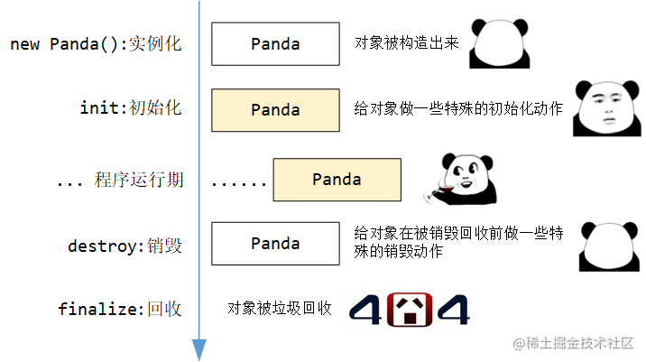

## [《从0开始深入学习Spring》](https://s.juejin.cn/ds/YGA3GYc/) ，点击查看原书

Spring是一个开源的企业级Java开发框架，可以更容易的构建出Java应用，
并且可以根据应用开发的组件需要进行整合（容器：管理应用中使用的组件Bean、托管Bean的生命周期、事件与监听器的驱动），
它的核心是IOC和AOP，它的强大之处还体现在对事务的控制上。

### ioc_medium

#### 1. BeanFactory和它的子接口们

BeanFactory的基础特性：

- **最基础的容器**
- **定义了作用域的概念**
- **集成环境配置**：它本身是所有 Bean 的注册中心，所有的 Bean 最终都在BeanFactory中创建和保存。
另外 BeanFactory 中还集成了配置信息，咱通过加载外部的 properties 文件，借助 SpringFramework 的方式将配置文件的属性值设置到 Bean 对象中。
- **支持多种类型的配置源**
- **完整的生命周期控制机制**
- **层次性的设计**：可以支持**父子结构**，由HierarchicalBeanFactory实现

##### 1.1 HierarchicalBeanFactory

实现BeanFactory的子接口，它可以理解为是层次结构的一部分。
可以在 `ConfigurableBeanFactory` 接口中找到用于 BeanFactory 的相应 `setParentBeanFactory` 方法，该方法允许以可配置的方式设置父对象

如果当前容器中找不到就往上找，那如果找到了就不往上找了。但是**如果当前 BeanFactory 中有指定的 Bean 了，父 BeanFactory 中可能有吗**？

**答案是有，因为即便存在父子关系，但他们本质上是不同的容器，所以有可能找到多个相同的 Bean 。**
换句话说，@Scope 中声明的 Singleton 只是在一个容器中是单实例的，但有了层次性结构后，对于整体的多个容器来看，就不是单实例的了。

##### 1.2 ListableBeanFactory

它的扩展功能是能让咱在拿到 BeanFactory 时可以直接把容器中的所有 Bean 都拿出来，但是它列举的仅仅是**当前容器中的Bean**

（可以看IOCMediumApplication中的代码例子）

##### 1.3 ConfigurableBeanFactory

`Configurable` **开头**的 BeanFactory 或者 ApplicationContext 就具有了 set（可写）的操作，
可以调用里边儿的定义的方法对BeanFactory进行修改和扩展等，但是它不推荐给开发者使用，因为在程序运行期间不应该对BeanFactory进行频繁的变动。

#### 2. BeanFactory的实现类们

##### 2.1 AbstractBeanFactory

它是BeanFactory**最基础的抽象实现类，具有基础的功能**，此外它还扩展了一些功能：别名的处理（来源于 AliasRegistry 接口）、
Bean 定义的合并、Bean 的销毁动作支持等，而且它还定义了模板方法`getBeanDefinition` 和 `createBean`

##### 2.2 AbstractAutowireCapableBeanFactory

它提供Bean的创建逻辑实现，具有**Bean 的创建**、**属性填充和依赖的自动注入**、**Bean 的初始化**功能。

它有`resolveDependency(DependencyDescriptor, String, Set, TypeConverter)`模板方法，具有解析Bean的成员中定义的属性依赖关系，
但是**不负责**BeanDefinition的注册。

##### 2.3 DefaultListableBeanFactory

DefaultListableBeanFactory是BeanFactory的最终默认实现，它的作用是**先注册 Bean 的定义信息(BeanDefinitionRegistry)，
再完成 Bean 的创建和初始化动作(AbstractAutowireCapableBeanFactory)**

#### 3. ApplicationContext和它的上下辈们

Application是Spring中最核心的接口，在BeanFactory基础上扩展了**生命周期管理**，**Bean和BeanFactory的后置处理器**，**国际化**以及**事件发布机制**。

继承`ListableBeanFactory`可以访问应用程序中的组件Bean，继承`ResourceLoader`能加载文件资源，
继承`ApplicationEventPublisher`实现事件的发布和监听机制，继承`MessageSource`实现国际化，继承`HierarchicalBeanFactory`以支持父子上下文。

##### 3.1 ConfigurableApplicationContext

注意它也是`Configurable`开头的，那么它会提供 **"可写"** 的功能，为ApplicationContext添加了配置的功能，它有定义**指定父容器**，**Environment**，
**BeanFactory的后置处理器**的方法等

##### 3.2 EnvironmentCapable

在 SpringFramework 中，**以 Capable 结尾的接口**，**通常意味着可以通过这个接口的某个特定的方法（通常是 `getXXX()` ）拿到特定的组件。**
Application实现了这个接口，那么它能拿到`Environment`对象。

我们可以这么理解，Spring的应用在运行时包含两部分：**应用程序本身**和**应用程序运行时的环境**。`Environment`就类似于**运行环境的抽象对象**，
它内部保存着一些程序运行的配置。

#### 4. ApplicationContext的实现类们

##### 4.1 AbstractApplicationContext

它是Application中最核心的实现类，没有之一。它定义和实现了**绝大部分应用上下文的特性和功能**。

使用了模板方法模式，实际的动作由子类去实现。直接继承了`DefaultResourceLoader`，提供默认的加载资源文件策略，从classpath下加载。

##### 4.2 AbstractXmlApplicationContext

它是最终 `ClassPathXmlApplicationContext` 和 `FileSystemXmlApplicationContext` 的直接父类，已**具备全部基本功能**。
根据子类不同的配置文件，实现`getConfigResources` 和/或 `getConfigLocations` 方法即可。

##### 4.3 ClassPathXmlApplicationContext

它是一个最终落地实现，对classpath下的xml文件进行加载，如果有多个配置，它解析配置文件有先后之分，
较新的BeanDefinition会覆盖掉之前的BeanDefinition。

##### 4.4 AnnotationConfigApplicationContext

它继承了`GenericApplicationContext` ，那自然它也只能刷新一次(因为GenericApplicationContext只能刷新(`refresh()方法`)一次)，
注解驱动的IOC容器。

它也有配置覆盖的概念，如果有多个 `@Configuration` 类，则在以后的类中定义的 `@Bean` 方法将覆盖在先前的类中定义的方法。
这可以通过一个额外的 `@Configuration` 类来故意覆盖某些 `BeanDefinition`。

它可以配合`XmlBeanDefinitionReader`，这样就能够注解驱动和xml配置通吃了。

#### 5. 事件机制
##### 5.1 观察者模式
观察者模式也被称为**发布订阅模式**，被观察的对象做出**某些动作**，**会自动通知到它的订阅者**。它的三大核心是：**观察者，被观察的主题，订阅者。**
观察者需要绑定要通知的订阅者，并且要观察指定的主题。

在Spring中体现观察者模式的就是**事件驱动和监听器**，**监听器（Listener）对应订阅者**，事件源充当被观察的主题，用来发布事件，
**IOC容器本身也是事件广播器，可以理解为观察者。** 可根据下图继续理解

##### 5.2 了解Spring内置事件

Spring容器内置事件

- **ContextRefreshedEvent**:  IOC容器刷新完毕但尚未启动，所有单实例 Bean 刚创建完
- **ContextClosedEvent**: IOC容器已经关闭但尚未销毁所有Bean
- **ContextStartedEvent**
- **ContextClosedEvent** 

我们点击以上任意一个事件，都是根据`ApplicationContextEvent`进行扩展的，如下

##### 5.3 自定义事件
实现ApplicationEvent来自定义事件（直接实现它并没有太大意义，更像是具体业务的触发时机），创建对应事件的监听器，在其中完成想要的业务

### ioc_easy

IOC的实现有两种方式: 依赖查找、依赖注入

- 依赖查找主动获取Bean

`byName`或`byClass`或`ofType（获取某类型的所有Bean）`或`获取带有指定注解的Bean`

- 依赖注入像是被动的接收依赖的Bean

`setter注入`、`构造器注入`，像@Value注解注入也是setter注入，`参数注入`见下图

Spring文档中的一个概念特别好：**DI 的思想是“推”**，它主张把组件需要的依赖“推”到组件的成员上；
**DL 的思想是”拉“**，组件需要哪些依赖需要组件自己去 IOC 容器中“拉取”。

- **【面试题】BeanFactory与ApplicationContext的对比**

BeanFactory能够进行配置和对Bean进行管理，提供了基本的API，ApplicationContext是它的子接口，也是对它的扩展。ApplicationContext支持AOP，
体现在Bean和BeanFactory的后置处理器上， 除此之外还有国际化、事件驱动（ApplicationEvent 、ApplicationListener）和资源管理（Resource）等。

---

`@PropertySource("classpath:cat.properties")`我们指定的properties 文件，它加载到 SpringFramework 的 IOC 容器后，
会转换成 Map 的形式来保存这些配置，而 SpringFramework 中本身在初始化时就有一些配置项，这些配置项也都放在这个 Map 中，
**${}** 的取值就是从这些配置项中取。

SpEL是真的强大，它的占位符是 **#{}**,在里边儿可以执行方法，指定值或者拿别的bean的值

---

- **【面试题】@Autowired注入的原理逻辑**

先拿属性对应的**类型**，去 IOC 容器中找 Bean ，如果找到了一个，直接返回；
如果找到多个类型一样的 Bean，把属性名拿过去（byName），跟这些 Bean 的 id 逐个对比（@Qualifier），如果有一个相同的，直接返回；
如果没有任何相同的 id 与要注入的属性名相同，则会抛出 `NoUniqueBeanDefinitionException` 异常。

---

`@Resource` 注解相当于标注 @Autowired 和 @Qualifier

---

- **【面试题】依赖注入的目的和优点**

依赖注入作为 IOC 的实现方式之一，目的就是**解耦**，我们不再需要直接去 new 那些依赖的类对象，而是把它交给Spring替我们管理；
而且，如果组件存在多级依赖，依赖注入可以将这些依赖的关系简化，开发者只需要定义好谁依赖谁即可。

依赖注入的另一个特点是依赖对象的**可配置**：通过 xml 或者注解声明，可以指定和调整组件注入的对象，借助 Java 的多态特性，
可以不需要大批量的修改就完成依赖注入的对象替换（面向接口编程与依赖注入配合近乎完美）。

---

- 了解：Bean注入大部分可以用@Autowired来解决，它的回调机制是通过一系列`Aware接口`来实现的

---

Bean的类型包含**普通Bean**和**工厂Bean**。工厂Bean用来创建使用注解或xml配置创建起来比较麻烦或依赖具体业务场景的Bean，它的接口方法如下。

- **【面试题】BeanFactory与FactoryBean的区别**

`BeanFactory` ：SpringFramework 中实现 IOC 的最底层容器
（此处的回答可以从两种角度出发：从类的继承结构上看，它是最顶级的接口，也就是最顶层的容器实现；
从类的组合结构上看，它则是最深层次的容器，ApplicationContext 在最底层组合了 BeanFactory ）

`FactoryBean` ：**创建对象的工厂Bean**，可以使用它来直接创建一些初始化流程比较复杂的对象，
FactoryBean的创建时机是和IOC容器的初始化一起的，而对具体的对象创建是懒加载机制。

---

如果一个对象允许同时被多个地方访问，那么它的作用域就可以提的很高，
反之如果一个对象伴随着一个时效性强的、带强状态的动作，那这个作用域就应该局限于这一个动作，在不同的动作下有一个不同的对象。

SpringFramework内置的作用域
- singleton: 单例bean，默认
- prototype: 原型bean，每次获取都创建一个
- request: 一次web请求创建一个
- session: 一个会话创建一个（web）
- application: 一个web应用创建一个
- websocket: 一个websocket创建一个

---

FactoryBean创建对象只需注入FactoryBean即可，IOC容器自动识别**创建想要的Bean**。

---

- Bean的生命周期

一个对象从被创建，到被垃圾回收，可以宏观的划分为 5 个阶段：

- **创建 / 实例化阶段**：此时会调用类的构造方法，产生一个新的对象
- **初始化阶段**：此时对象已经创建好，但还没有被正式使用，可能这里面需要做一些额外的操作（如预初始化数据库的连接池）
- **运行使用期**：此时对象已经完全初始化好，程序正常运行，对象被使用
- **销毁阶段**：此时对象准备被销毁，已不再使用，需要预先的把自身占用的资源等处理好（如关闭、释放数据库连接）
- **回收阶段**：此时对象已经完全没有被引用了，被垃圾回收器回收

而Spring**能进行干预的只有初始化阶段和销毁阶段**，我们可以指定`init-method`和`destroy-method`，init-method的执行时机是在属性赋值之后。
或者也可以通过JSR250规范中的注解`@PostConstruct`和`@PreDestroy`实现再或者实现`InitializingBean`或`DisposableBean`接口

这三种方式中执行的优先级`@PostConstruct` > `InitializingBean` > `init-method`

原型Bean它不会处理`destroy-method`